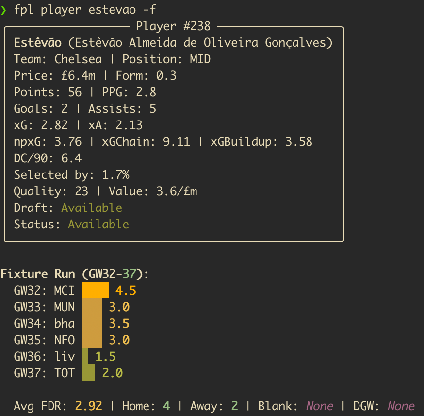

# fpl-cli

Fantasy Premier League analysis from the terminal. Classic and Draft formats. Five data sources, one interface.

[](https://pypi.org/project/fplkit/)
[](https://www.python.org/downloads/)
[](LICENSE)



## Features

- **Multi-source data** - FPL API, Draft API, Understat (npxG/xGChain), vaastav historical dataset, and football-data.org in one place.
- **Player scouting** - Filter by any stat, track xG trends, spot underperformers, check fixture runs.
- **Fixture intelligence** - Bayesian difficulty ratings from actual match results, blank/double GW detection, squad exposure analysis.
- **Custom analysis** - Captain picks, transfer targets, differentials, waivers, and ILP-optimal squad allocation. Opt-in, off by default.
- **Gameweek reports** - Post-GW reviews and league recaps with optional LLM narrative.
- **Draft parity** - Most commands work for both Classic and Draft. Waivers cover the free-agent wire.
- **Agent-friendly** - `--format json` with a consistent envelope on key commands. Ready-made agent skills in `.agents/skills/`.

## Quickstart

```console
$ pipx install fplkit
$ fpl init
$ fpl status
$ fpl stats -p MID -s form --available-only
```

`fpl init` configures your FPL IDs and optional features. With just an entry ID you get the full data toolkit.

## Installation

Requires **Python 3.11+**.

```console
$ pipx install fplkit
```

Alternatives: `uv pip install fplkit` or `pip install fplkit`.

> [!NOTE]
> Browser scraping (`fpl squad sell-prices --refresh`) requires the scraper extra and Playwright:
> ```console
> $ pipx install 'fplkit[scraper]'
> $ playwright install chromium
> ```

## Usage

### After the Gameweek

```console
$ fpl status                       # GW result, deadline, rank movement, flagged players
$ fpl review --save --summarise    # Full review with LLM narrative
$ fpl league                       # Live league standings
$ fpl league-recap --summarise     # Awards and editorial for the group chat
```

### Scouting Players

```console
$ fpl stats -p FWD -s form -a             # Forwards by form, excluding unavailable
$ fpl player Rice -f -u                   # Deep dive: fixtures + Understat analysis
$ fpl xg                                  # xG/xA analysis, over/underperformers
$ fpl history                             # Career arc across 3 seasons
$ fpl price-history -n 4 -s price_slope   # Bandwagon detection
```

### Before the Deadline

```console
$ fpl squad                        # Squad health: form, injuries, recommendations
$ fpl squad grid -n 8 -w Mbeumo    # 8-GW fixture difficulty grid with a watchlist player
$ fpl fdr --my-squad               # Your squad's blank/double GW exposure
$ fpl preview --save --scout       # Full analysis + BUY/SELL research via LLM
```

### Strategic Planning

```console
$ fpl fdr --blanks                 # Confirmed + predicted blank/double GWs
$ fpl chips timing                 # Rule-based Free Hit / Bench Boost / Triple Captain signals
$ fpl fixtures                     # Next GW fixtures with FDR
```

### Custom Analysis

Off by default. Enable via `fpl init` or `custom_analysis: true` in settings.yaml.

```console
$ fpl captain                      # Ranked captain picks (0-100 matchup scoring)
$ fpl targets --min-own 30         # Transfer targets, template tier
$ fpl differentials -t 3           # Ultra-differentials (<3% owned)
$ fpl waivers                      # Free-agent waiver picks with drop suggestions (draft)
$ fpl transfer-eval --out Palmer --in "Salah,Mbeumo"  # Side-by-side comparison
$ fpl allocate --horizon 1         # Free Hit: optimal squad for a single GW
$ fpl ratings                      # Bayesian team strength ratings from match results
```

Enabling custom analysis also enriches other commands: `fpl stats` gains `--value` columns, `fpl xg` adds Value Picks, `fpl fdr` upgrades to Bayesian FDR with ATK/DEF split.

### JSON Output

Commands with `--format json` emit a consistent envelope:

```json
{
  "command": "stats",
  "metadata": {"gameweek": null, "format": "classic", "custom_analysis": true},
  "data": [...]
}
```

```console
$ fpl stats --format json -p MID -s expected_goal_involvements
$ fpl status --format json
$ fpl fdr --blanks --format json
```

## Configuration

Run `fpl init` to configure interactively. Settings stored in your platform's config directory (override with `FPL_CLI_CONFIG_DIR`).

**Required:** FPL classic entry ID or draft league + entry IDs.

| Feature | What it enables |
|---------|----------------|
| Custom Analysis | Captain, targets, differentials, waivers, allocate, ratings, value scores, Bayesian FDR |
| League ID | Standings, fines, league recaps |
| LLM providers | `--summarise` and `--scout` flags (Perplexity, Anthropic, OpenAI, or any compatible API) |
| FPL credentials | `fpl squad sell-prices` (browser scraping) |
| `FOOTBALL_DATA_API_KEY` | League table in `fpl review` |

```bash
# LLM providers (for --summarise and --scout)
export PERPLEXITY_API_KEY="your-key"    # Research role
export ANTHROPIC_API_KEY="your-key"     # Synthesis role
```

See [Command Reference](docs/command-reference.md#configuration-reference) for the full settings.yaml schema and LLM provider setup.

## Development

```console
$ git clone https://github.com/rossgroomio/fpl-cli.git
$ cd fpl-cli
$ python3 -m venv .venv && source .venv/bin/activate
$ pip install -e ".[dev]"
$ fpl init
```

```console
$ ruff check fpl_cli/    # Lint
$ pyright fpl_cli/       # Type check
$ pytest tests/          # Tests
```

> [!NOTE]
> Football data provided by the [Football-Data.org API](https://www.football-data.org/). Player and fixture data is property of the Premier League. Expected goals data is property of [Understat](https://understat.com). Historical data from [vaastav/Fantasy-Premier-League](https://github.com/vaastav/Fantasy-Premier-League) (MIT). This tool fetches data at runtime and does not redistribute third-party data.

> [!WARNING]
> Browser scraping (`fpl squad sell-prices`) uses your FPL login to read sell prices. Automated access may violate FPL website terms - use at your own risk.

---

[Command Reference](docs/command-reference.md) | [Architecture](docs/architecture.md) | [Agent Tools & Skills](.agents/TOOLS.md)
