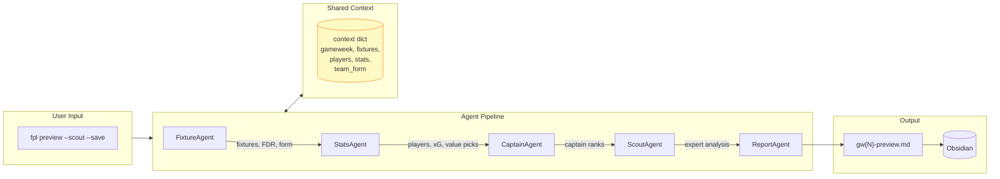
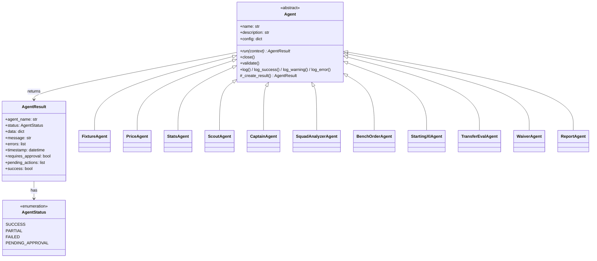
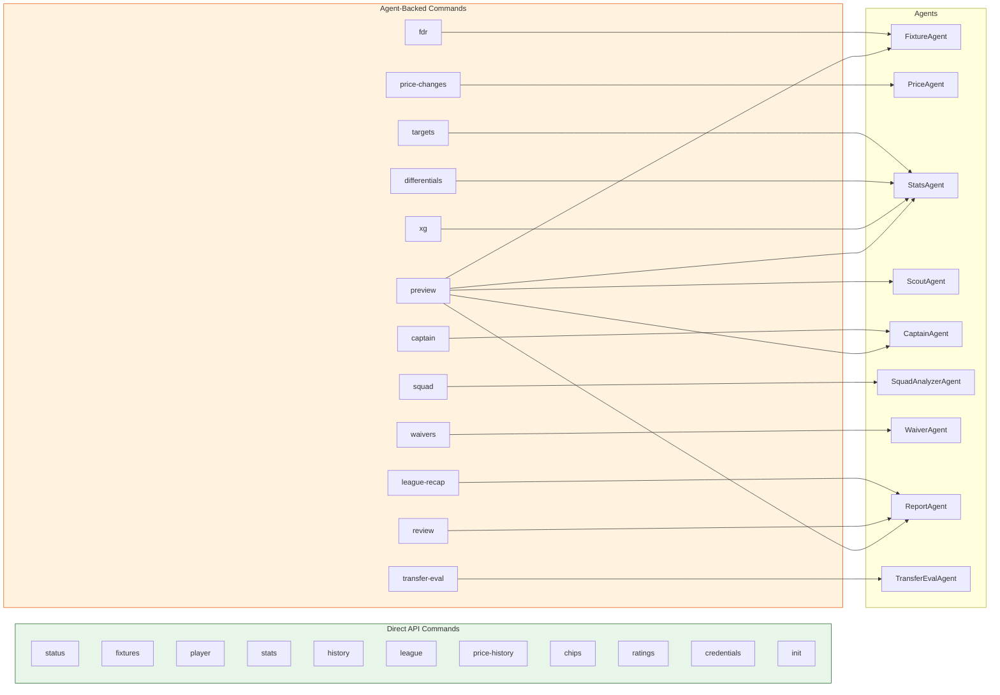
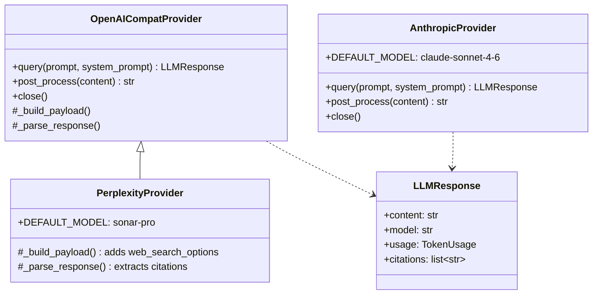
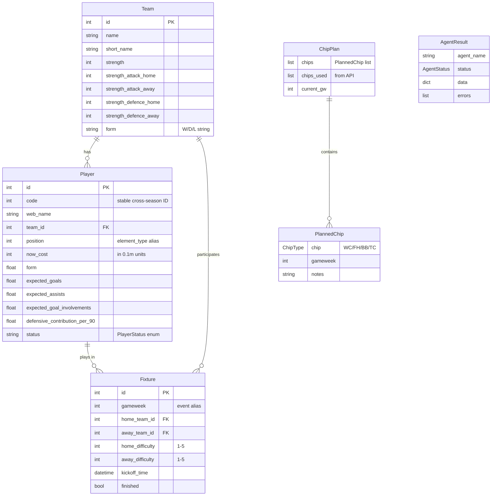
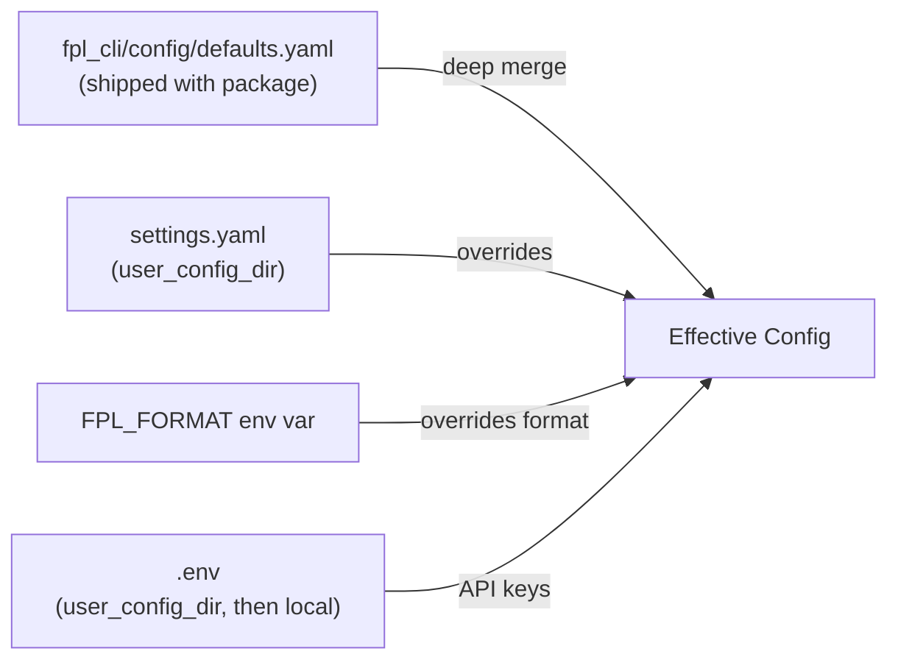

# FPL CLI Architecture

```mermaid
flowchart TB
    subgraph CLI["CLI Layer"]
        cli[cli/__init__.py<br/>FormatAwareGroup]
        ctx[_context.py<br/>Format detection]
        helpers[_helpers.py / _json.py<br/>Display & JSON output]
    end

    subgraph Config["Configuration"]
        defaults[config/defaults.yaml]
        settings[~/...fpl-cli/settings.yaml]
        env[".env<br/>API Keys"]
    end

    subgraph Agents["Agent Layer"]
        subgraph DataAgents["Data Agents"]
            fixture[FixtureAgent]
            price[PriceAgent]
            scout[ScoutAgent]
        end

        subgraph AnalysisAgents["Analysis Agents"]
            stats[StatsAgent]
            captain[CaptainAgent]
            squad_analyzer[SquadAnalyzerAgent]
            bench[BenchOrderAgent]
            starting_xi[StartingXIAgent]
            transfer_eval[TransferEvalAgent]
        end

        subgraph ActionAgents["Action Agents"]
            waiver[WaiverAgent]
        end

        subgraph OrchAgents["Orchestration Agents"]
            report[ReportAgent]
        end
    end

    subgraph Services["Services"]
        player_scoring[player_scoring<br/>Scoring engines]
        player_prior[player_prior<br/>Bayesian early-season confidence]
        team_ratings[TeamRatingsService<br/>1-7 strength scale]
        matchup[matchup<br/>3-GW matchup scores]
        fixture_preds[FixturePredictionsService<br/>BGW/DGW predictions]
        team_form[team_form<br/>Form stats]
    end

    subgraph APIClients["API Clients"]
        fpl_client[FPLClient]
        draft_client[FPLDraftClient]
        understat_client[UnderstatClient]
        vaastav_client[VaastavClient]
        football_data[FootballDataClient]
    end

    subgraph LLMProviders["LLM Providers"]
        anthropic_prov[AnthropicProvider]
        openai_prov[OpenAICompatProvider]
        perplexity_prov[PerplexityProvider]
    end

    subgraph Scraper["Scraper"]
        scraper[FPLPriceScraper]
    end

    subgraph Models["Data Models"]
        player_m[Player]
        fixture_m[Fixture]
        team_m[Team]
        chip_plan[ChipPlan]
        result_m[AgentResult]
        types_m[TypedDicts<br/>CaptainCandidate, WaiverTarget,<br/>EnrichedPlayer, etc.]
    end

    subgraph Prompts["Prompts"]
        scout_p[scout.py]
        review_p[review.py]
        recap_p[league_recap.py]
    end

    subgraph Templates["Jinja2 Templates"]
        preview_tmpl[gw_preview.md.j2]
        review_tmpl[gw_review.md.j2]
        recap_tmpl[gw_league_recap.md.j2]
    end

    subgraph External["External Services"]
        fpl_api[("FPL API")]
        draft_api[("Draft API")]
        understat_web[("understat.com")]
        vaastav_gh[("vaastav/FPL<br/>GitHub")]
        football_api[("football-data.org")]
        llm_apis[("Claude / OpenAI /<br/>Perplexity APIs")]
        fpl_web[("FPL Website")]
    end

    subgraph Output["Output"]
        console[Rich Console]
        obsidian[("Obsidian Vault<br/>01_Reports/")]
    end

    %% CLI connections
    cli --> ctx
    cli --> helpers
    cli --> defaults & settings & env
    cli --> DataAgents & AnalysisAgents & ActionAgents & OrchAgents

    %% Agent -> Service connections
    fixture --> team_ratings & fixture_preds & matchup
    captain --> player_scoring
    bench --> player_scoring
    starting_xi --> player_scoring
    transfer_eval --> player_scoring
    stats --> player_scoring
    waiver --> player_scoring
    scout --> Prompts

    %% Agent -> API connections
    fixture --> fpl_client
    price --> fpl_client
    stats --> fpl_client
    scout --> LLMProviders
    captain --> fpl_client
    squad_analyzer --> fpl_client
    bench --> fpl_client
    starting_xi --> fpl_client
    transfer_eval --> fpl_client
    waiver --> draft_client & fpl_client

    %% Service -> API connections
    player_prior --> vaastav_client
    player_scoring --> player_prior
    team_ratings --> understat_client
    team_ratings --> football_data

    %% Orchestration
    report --> Templates --> obsidian
    report --> console

    %% LLM Provider connections
    anthropic_prov & openai_prov & perplexity_prov --> llm_apis

    %% API Client -> External
    fpl_client --> fpl_api
    draft_client --> draft_api
    understat_client --> understat_web
    vaastav_client --> vaastav_gh
    football_data --> football_api
    scraper --> fpl_web

    %% Models
    Agents -.-> Models
    Services -.-> Models

    %% Styling
    classDef cli fill:#e1f5fe,stroke:#01579b
    classDef data fill:#e8f5e9,stroke:#1b5e20
    classDef analysis fill:#fff3e0,stroke:#e65100
    classDef action fill:#ffebee,stroke:#b71c1c
    classDef orch fill:#e3f2fd,stroke:#0d47a1
    classDef service fill:#f1f8e9,stroke:#33691e
    classDef api fill:#fce4ec,stroke:#880e4f
    classDef external fill:#f5f5f5,stroke:#424242
    classDef output fill:#e8eaf6,stroke:#1a237e

    class cli,ctx,helpers cli
    class fixture,price,scout data
    class stats,captain,squad_analyzer,bench,starting_xi,transfer_eval analysis
    class waiver action
    class report orch
    class player_scoring,team_ratings,matchup,fixture_preds,team_form service
    class fpl_client,draft_client,understat_client,vaastav_client,football_data,scraper,anthropic_prov,openai_prov,perplexity_prov api
    class fpl_api,draft_api,understat_web,vaastav_gh,football_api,llm_apis,fpl_web external
    class console,obsidian output
```

System design and module structure for contributors. For scoring formulas and methodology, see the [Custom Analysis Guide](custom-analysis.md). For command usage, see the [Command Reference](command-reference.md).



## Data Flow: Preview Pipeline



## Agent Inheritance



## CLI Command Mapping



### Format Awareness

Commands are classified by format applicability:

| Category | Commands |
|---|---|
| **Classic only** | `captain`, `targets`, `differentials`, `chips`, `credentials` |
| **Draft only** | `waivers` |
| **General** | Everything else (format-gated sections within) |

`FormatAwareGroup` auto-hides inapplicable commands in `--help` based on configured format. Format resolved from settings (`classic_entry_id` / `draft_league_id`) or `FPL_FORMAT` env var.

### Custom Analysis Gating

Commands are independently classified by the `custom_analysis` toggle:

| Category | Commands | When opted out |
|---|---|---|
| **Pure-experimental** | `captain`, `targets`, `differentials`, `waivers`, `allocate`, `transfer-eval`, `ratings` | Unregistered from CLI |
| **Mixed** | `stats`, `xg`, `fdr`, `preview` | Experimental columns/sections stripped |
| **Data-only** | Everything else | No change |

`FormatAwareGroup.list_commands()` and `get_command()` filter out the `EXPERIMENTAL` frozenset when `custom_analysis` is off. Mixed commands check `is_custom_analysis_enabled()` within their `_run()` to gate experimental columns/sections. Both filters (format and experimental) are independent and must both pass.

## Services Layer

Services live in `fpl_cli/services/` and provide the computation layer between agents and API clients. For scoring formulas, weight definitions, and methodology detail, see the [Custom Analysis Guide](custom-analysis.md#services-overview).

| Service | Purpose |
|---|---|
| `player_scoring` | Central scoring engine: `prepare_scoring_data()`, all score functions, `shrink_scores()` |
| `player_prior` | Bayesian early-season confidence (GW1-10 shrinkage) |
| `team_ratings` | TeamRatingsService + Calculator (1-7 scale, 4 axes) |
| `matchup` | Fixture matchup scoring (0-10), 3-GW recency-weighted |
| `fixture_predictions` | BGW/DGW predictions from YAML + live detection |
| `squad_allocator` | ILP squad allocator (PuLP CBC), horizon-aware, chip-aware |
| `team_form` | Rolling team form stats (last 6 matches, venue splits) |

## LLM Provider Abstraction



All providers share the `LLMResponse` contract. `OpenAICompatProvider` supports OpenAI, Groq, Together, Ollama via configurable `base_url`. Provider selection configured in settings.

## API Clients

| Client | External Source | Purpose |
|---|---|---|
| `FPLClient` | FPL API | Players, fixtures, managers, teams, bootstrap-static (cached) |
| `FPLDraftClient` | FPL Draft API | Draft leagues, waivers, squad data |
| `UnderstatClient` | understat.com | npxG, xA, xGChain, xGBuildup per-90 stats |
| `VaastavClient` | vaastav/FPL GitHub | Historical CSV data (3-4 seasons), price trends, GW-level profiles |
| `FootballDataClient` | football-data.org | League standings, match results |
| `FPLPriceScraper` | FPL website | Price change scraping (needs credentials) |

## Model Relationships



## Module Map

```
fpl_cli/
├── cli/                          # Click commands & groups
│   ├── __init__.py               # main() entry point, command registration
│   ├── _context.py               # Format enum, CLIContext, FormatAwareGroup (format + experimental gating), settings loader
│   ├── _helpers.py               # Shared display utilities
│   ├── _json.py                  # JSON output serialisation
│   ├── _banner.py                # Startup banner
│   ├── _plan_grid.py             # Fixture grid rendering
│   ├── _review_*.py              # Review command helpers (analysis, classic, draft, summarisation)
│   ├── _league_recap_*.py        # League recap helpers & types
│   ├── _fines.py / _fines_config.py  # League fines system
│   └── [command files]           # One file per command/group
├── agents/
│   ├── base.py                   # Agent ABC, AgentResult, AgentStatus
│   ├── common.py                 # Shared: enrich_player, fetch_understat_lookup, draft helpers
│   ├── data/                     # FixtureAgent, PriceAgent, ScoutAgent
│   ├── analysis/                 # StatsAgent, CaptainAgent, SquadAnalyzerAgent, BenchOrderAgent, StartingXIAgent, TransferEvalAgent
│   ├── action/                   # WaiverAgent
│   └── orchestration/            # ReportAgent
├── api/
│   ├── fpl.py                    # FPLClient (main API, caches bootstrap-static)
│   ├── fpl_draft.py              # FPLDraftClient
│   ├── understat.py              # UnderstatClient + match_fpl_to_understat()
│   ├── vaastav.py                # VaastavClient (historical seasons, GW trends)
│   ├── football_data.py          # FootballDataClient (standings, match results)
│   └── providers/                # LLM provider abstraction
│       ├── _models.py            # LLMResponse, TokenUsage, ProviderError
│       ├── anthropic.py          # AnthropicProvider
│       ├── openai_compat.py      # OpenAICompatProvider (OpenAI, Groq, Together, Ollama)
│       └── perplexity.py         # PerplexityProvider (extends OpenAICompat)
├── services/
│   ├── player_scoring.py         # Scoring engines + prepare_scoring_data() + shrink_scores()
│   ├── player_prior.py           # Player prior (Bayesian early-season confidence)
│   ├── team_ratings.py           # TeamRatingsService + Calculator (1-7 scale)
│   ├── team_ratings_prior.py     # Pre-GW5 prior ratings for blending
│   ├── matchup.py                # Fixture matchup scoring (0-10)
│   ├── fixture_predictions.py    # BGW/DGW predictions from YAML + live detection
│   ├── squad_allocator.py        # ILP squad allocator (PuLP CBC) - score, fixture coefficients, solver. Horizon-aware: horizon=1 uses single-GW scoring (GW_SELECTION_WEIGHTS), horizon>=2 uses ownership-family quality (VALUE_QUALITY_WEIGHTS). Chip-aware: --bench-discount (Free Hit), --bench-boost-gw (Bench Boost per-GW override to 1.0), --sell-prices (WC/FH sell-price budget correction via price_overrides dict)
│   └── team_form.py              # Rolling team form stats
├── models/
│   ├── player.py                 # Player, PlayerStatus, PlayerPosition, POSITION_MAP
│   ├── team.py                   # Team
│   ├── fixture.py                # Fixture
│   ├── chip_plan.py              # ChipPlan, ChipType, PlannedChip, UsedChip
│   └── types.py                  # TypedDicts: CaptainCandidate, WaiverTarget, EnrichedPlayer, etc.
├── prompts/
│   ├── scout.py                  # ScoutAgent system/user prompts
│   ├── review.py                 # Review research prompts
│   └── league_recap.py           # League recap synthesis prompts
├── parsers/
│   └── recommendations.py        # Parse gw{N}-recommendations.md into structured decisions
├── scraper/
│   └── fpl_prices.py             # FPLPriceScraper (needs FPL_EMAIL/FPL_PASSWORD)
├── paths.py                      # SHIPPED_CONFIG_DIR, TEMPLATE_DIR, user_config_dir(), user_data_dir()
├── season.py                     # Season year detection, TOTAL_GAMEWEEKS, CHIP_SPLIT_GW
└── constants.py                  # MIN_MINUTES_FOR_PER90

platformdirs (user_config_dir / user_data_dir)  # macOS: ~/Library/Application Support/fpl-cli/
├── settings.yaml                 # User overrides, created by `fpl init`
├── fixture_predictions.yaml      # BGW/DGW predictions (migrated from repo config/)
├── team_managers.yaml            # Manager name mappings (migrated from repo config/)
├── team_ratings_overrides.yaml   # Manual per-team axis overrides (migrated from repo config/)
├── team_ratings.yaml             # Cached team strength ratings (auto-refreshed)
├── player_prior.yaml             # Cached player priors (generated, season/GW invalidation)
├── chip_plan.json                # User's chip plan (created via `fpl chips add`)
└── team_finances.json            # Cached sell prices from scraper (12h TTL)
```

## Agent Skills

```
.agents/
├── README.md                     # Directory purpose and adaptation guide
└── skills/                       # Showcase agent skills (canonical location)
    ├── gw-prep/                  # Gameweek preparation (parallel sub-agents)
    │   ├── SKILL.md
    │   ├── references/
    │   │   ├── rules.md          # Transfer/waiver/selection rules
    │   │   └── output-template.md
    │   └── scripts/
    │       ├── bench_order.py    # BenchOrderAgent wrapper (name -> ID resolution)
    │       ├── starting_xi.py   # StartingXIAgent wrapper (name -> ID resolution)
    │       └── transfer_eval.py # TransferEvalAgent wrapper (name -> ID resolution)
    ├── update-gw-prep/           # Second-pass addendum with supplementary data
    │   └── SKILL.md
    ├── squad-builder/            # 5-mode squad optimisation (WC/FH/season-start/draft/redraft)
    │   ├── SKILL.md
    │   └── references/
    │       ├── rules.md
    │       └── output-template.md
```

**Discovery:** `.claude/skills/` is a symlink to `../.agents/skills`. Claude Code discovers skills via the symlink; other tools read `.agents/skills/` directly. `AGENTS.md` symlinks to `CLAUDE.md` for multi-agent compatibility.

**Adaptation:** Skills are showcase examples with `<!-- ADAPT: ... -->` comments at customisation points. Output paths use `[YOUR_OUTPUT_DIR]` placeholders. All CLI data gathering uses `--format json`.

## Config Resolution



User settings deep-merged over committed defaults via `platformdirs`. `.env` loaded from user config dir first, local `.env` fills gaps (via `python-dotenv`). Format auto-detected from which entry IDs are configured (classic, draft, or both).

## Design Decisions

- **Between-gameweek focus.** No live mid-GW scores - tools like LiveFPL serve that job.
- **Data first, opinions opt-in.** Core commands show aggregated data from multiple sources. Custom analysis (scoring, rankings, recommendations) is a separate toggle so users can trust the data layer without buying into experimental algorithms.
- **No transfer planner.** Multi-week transfer sequencing is better in a spreadsheet. The CLI provides the inputs (`fdr`, `chips timing`, `fixtures`).
- **Draft parity.** Most commands work for both classic and draft formats. Draft support focuses on free-agent pickups via the waiver system - trade recommendations between managers are out of scope.
- **Agent-friendly.** `--format json` on key commands with a consistent envelope. See [Agent Tools & Skills](../.agents/TOOLS.md).
- **LLM features are opt-in.** Core analysis works without any API keys. LLM providers add narrative and research capabilities.

