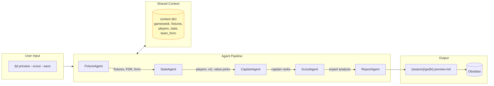
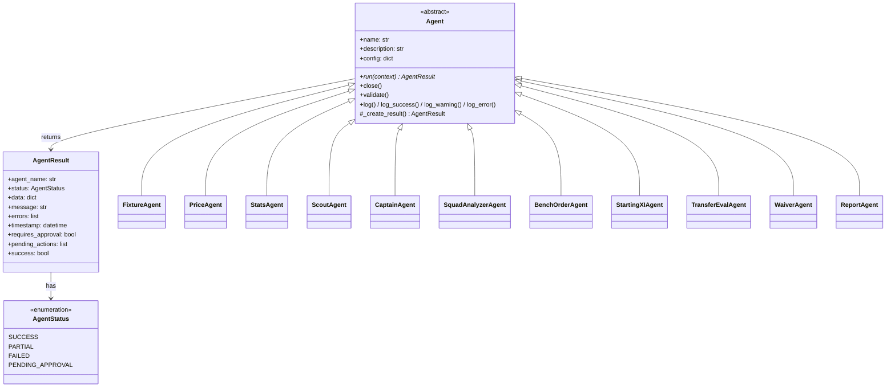
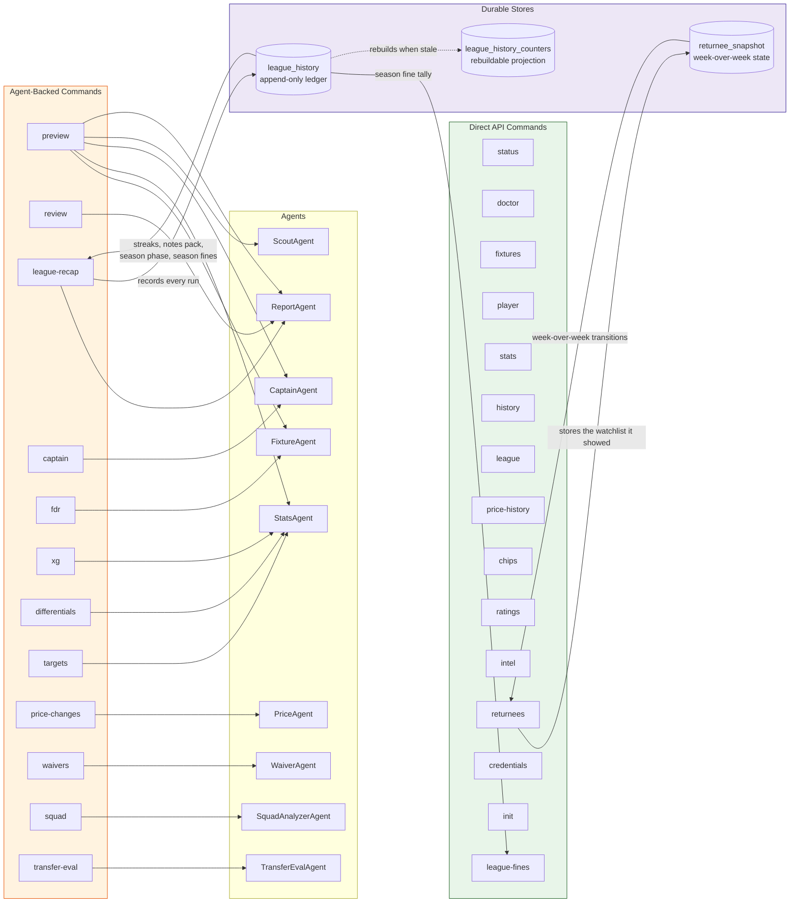
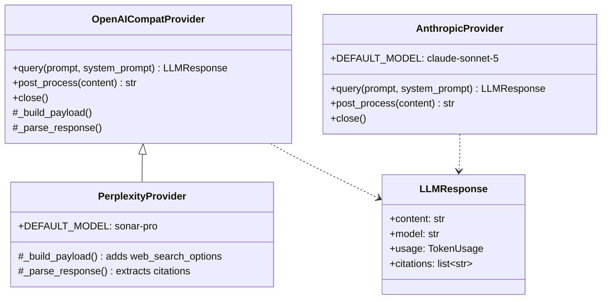
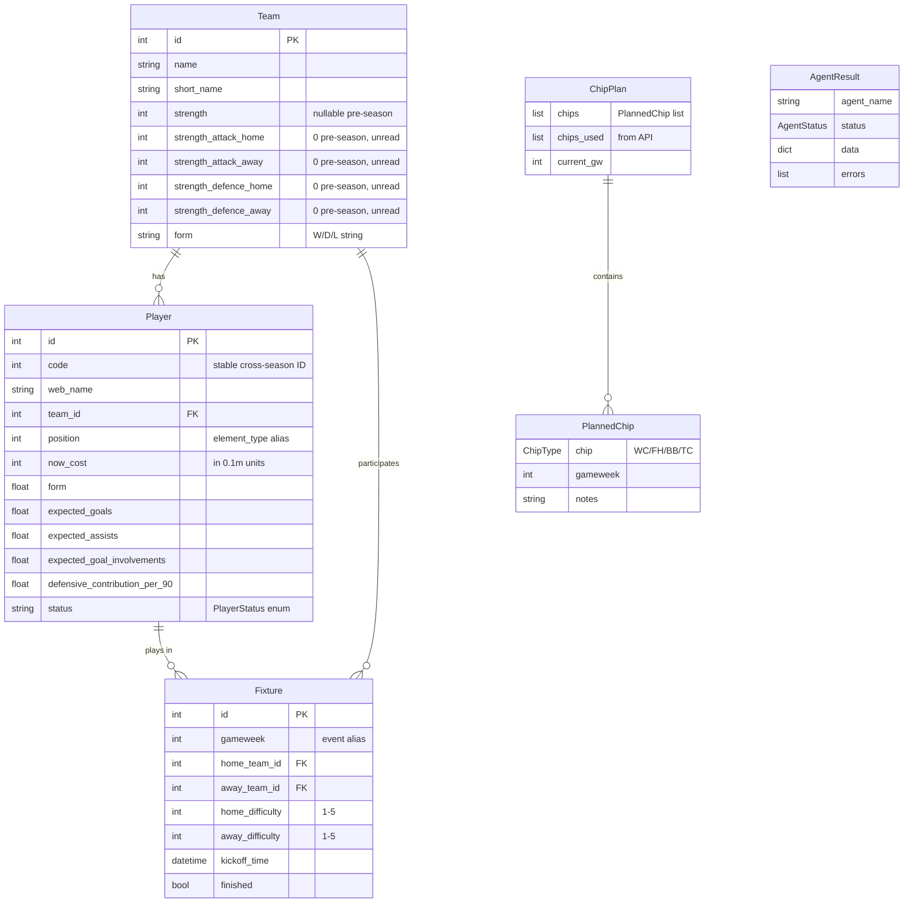
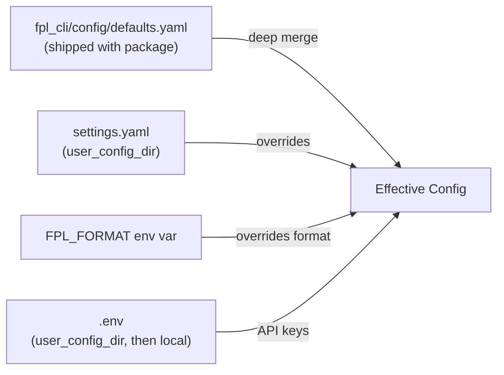

# FPL CLI Architecture

System design and module structure for contributors. For scoring formulas and methodology, see the [Custom Analysis Guide](custom-analysis.md). For command usage, see the [Command Reference](command-reference.md).


```mermaid
flowchart TB
    subgraph CLI["CLI Layer"]
        cli[cli/__init__.py<br/>FormatAwareGroup]
        ctx[_context.py<br/>Format detection]
        helpers[_helpers.py / _json.py<br/>Display & JSON output]
    end

    subgraph Config["Configuration"]
        defaults[config/defaults.yaml]
        settings[~/...fpl-cli/settings.yaml]
        env[".env<br/>API Keys"]
    end

    subgraph Agents["Agent Layer"]
        subgraph DataAgents["Data Agents"]
            fixture[FixtureAgent]
            price[PriceAgent]
            scout[ScoutAgent]
        end

        subgraph AnalysisAgents["Analysis Agents"]
            stats[StatsAgent]
            captain[CaptainAgent]
            squad_analyzer[SquadAnalyzerAgent]
            bench[BenchOrderAgent]
            starting_xi[StartingXIAgent]
            transfer_eval[TransferEvalAgent]
        end

        subgraph ActionAgents["Action Agents"]
            waiver[WaiverAgent]
        end

        subgraph OrchAgents["Orchestration Agents"]
            report[ReportAgent]
        end
    end

    subgraph Services["Services (agent-reachable)"]
        scoring[scoring/<br/>Scoring engine package]
        player_prior[player_prior<br/>Bayesian early-season confidence]
        team_ratings[TeamRatingsService<br/>1-7 strength scale]
        matchup[matchup<br/>3-GW matchup scores]
        fixture_preds[FixturePredictionsService<br/>BGW/DGW predictions]
        team_form[team_form<br/>Form stats]
    end

    subgraph APIClients["API Clients"]
        fpl_client[FPLClient]
        draft_client[FPLDraftClient]
        understat_client[UnderstatClient]
        vaastav_client[VaastavClient]
        core_insights_client[CoreInsightsClient]
        historical_provider[HistoricalDataProvider]
        football_data[FootballDataClient]
    end

    subgraph LLMProviders["LLM Providers"]
        anthropic_prov[AnthropicProvider]
        openai_prov[OpenAICompatProvider]
        perplexity_prov[PerplexityProvider]
    end

    subgraph Scraper["Scraper"]
        scraper[FPLPriceScraper]
    end

    subgraph Models["Data Models"]
        player_m[Player]
        fixture_m[Fixture]
        team_m[Team]
        chip_plan[ChipPlan]
        result_m[AgentResult]
        types_m[TypedDicts<br/>CaptainCandidate, WaiverTarget,<br/>EnrichedPlayer, etc.]
    end

    subgraph Prompts["Prompts"]
        scout_p[scout.py]
        review_p[review.py]
        recap_p[league_recap.py]
    end

    subgraph Templates["Jinja2 Templates"]
        preview_tmpl[gw_preview.md.j2]
        review_tmpl[gw_review.md.j2]
        recap_tmpl[gw_league_recap.md.j2]
    end

    subgraph External["External Services"]
        fpl_api[("FPL API")]
        draft_api[("Draft API")]
        understat_web[("understat.com")]
        vaastav_gh[("vaastav/FPL<br/>GitHub")]
        core_insights_gh[("Core-Insights/FPL<br/>GitHub")]
        football_api[("football-data.org")]
        llm_apis[("Claude / OpenAI /<br/>Perplexity APIs")]
        fpl_web[("FPL Website")]
    end

    subgraph Output["Output"]
        console[Rich Console]
        obsidian[("Obsidian Vault<br/>01_Reports/{season}/")]
    end

    %% CLI connections
    cli --> ctx
    cli --> helpers
    cli --> defaults & settings & env
    cli --> DataAgents & AnalysisAgents & ActionAgents & OrchAgents

    %% Agent -> Service connections
    fixture --> team_ratings & fixture_preds & matchup
    captain --> scoring
    bench --> scoring
    starting_xi --> scoring
    transfer_eval --> scoring
    stats --> scoring
    waiver --> scoring
    scout --> Prompts

    %% Agent -> API connections
    fixture --> fpl_client
    price --> fpl_client
    stats --> fpl_client
    scout --> LLMProviders
    captain --> fpl_client
    squad_analyzer -->|"get_player_detail()"| fpl_client
    bench --> fpl_client
    starting_xi --> fpl_client
    transfer_eval --> fpl_client
    waiver --> draft_client & fpl_client

    %% Service -> API connections
    player_prior --> historical_provider
    historical_provider --> vaastav_client
    historical_provider --> core_insights_client
    scoring --> player_prior
    team_ratings --> understat_client
    team_ratings --> football_data

    %% Orchestration
    report --> Templates --> obsidian
    report --> console

    %% LLM Provider connections
    anthropic_prov & openai_prov & perplexity_prov --> llm_apis

    %% API Client -> External
    fpl_client --> fpl_api
    draft_client --> draft_api
    understat_client --> understat_web
    vaastav_client --> vaastav_gh
    core_insights_client --> core_insights_gh
    football_data --> football_api
    scraper --> fpl_web

    %% Models
    Agents -.-> Models
    Services -.-> Models

    %% Styling
    classDef cli fill:#e1f5fe,stroke:#01579b
    classDef data fill:#e8f5e9,stroke:#1b5e20
    classDef analysis fill:#fff3e0,stroke:#e65100
    classDef action fill:#ffebee,stroke:#b71c1c
    classDef orch fill:#e3f2fd,stroke:#0d47a1
    classDef service fill:#f1f8e9,stroke:#33691e
    classDef api fill:#fce4ec,stroke:#880e4f
    classDef external fill:#f5f5f5,stroke:#424242
    classDef output fill:#e8eaf6,stroke:#1a237e

    class cli,ctx,helpers cli
    class fixture,price,scout data
    class stats,captain,squad_analyzer,bench,starting_xi,transfer_eval analysis
    class waiver action
    class report orch
    class scoring,team_ratings,matchup,fixture_preds,team_form service
    class fpl_client,draft_client,understat_client,vaastav_client,core_insights_client,historical_provider,football_data,scraper,anthropic_prov,openai_prov,perplexity_prov api
    class fpl_api,draft_api,understat_web,vaastav_gh,core_insights_gh,football_api,llm_apis,fpl_web external
    class console,obsidian output
```

## Data Flow: Preview Pipeline


```mermaid
flowchart LR
    subgraph Input["User Input"]
        cmd["fpl preview --scout --save"]
    end

    subgraph Pipeline["Agent Pipeline"]
        direction TB
        A[FixtureAgent] -->|fixtures, FDR, form| B[StatsAgent]
        B -->|players, xG, value picks| C[CaptainAgent]
        C -->|captain ranks| D[ScoutAgent]
        D -->|expert analysis| E[ReportAgent]
    end

    subgraph Context["Shared Context"]
        ctx[("context dict<br/>gameweek, fixtures,<br/>players, stats,<br/>team_form")]
    end

    subgraph Output["Output"]
        file["{season}/gw{N}-preview.md"]
        vault[("Obsidian")]
    end

    Input --> Pipeline
    Pipeline <--> Context
    E --> file --> vault

    style ctx fill:#fff9c4,stroke:#f57f17
```

## Agent Inheritance


```mermaid
classDiagram
    class Agent {
        <<abstract>>
        +name: str
        +description: str
        +config: dict
        +run(context) AgentResult*
        +close()
        +validate()
        +log() / log_success() / log_warning() / log_error()
        #_create_result() AgentResult
    }

    class AgentResult {
        +agent_name: str
        +status: AgentStatus
        +data: dict
        +message: str
        +errors: list
        +timestamp: datetime
        +requires_approval: bool
        +pending_actions: list
        +success: bool
    }

    class AgentStatus {
        <<enumeration>>
        SUCCESS
        PARTIAL
        FAILED
        PENDING_APPROVAL
    }

    Agent --> AgentResult : returns
    AgentResult --> AgentStatus : has

    Agent <|-- FixtureAgent
    Agent <|-- PriceAgent
    Agent <|-- StatsAgent
    Agent <|-- ScoutAgent
    Agent <|-- CaptainAgent
    Agent <|-- SquadAnalyzerAgent
    Agent <|-- BenchOrderAgent
    Agent <|-- StartingXIAgent
    Agent <|-- TransferEvalAgent
    Agent <|-- WaiverAgent
    Agent <|-- ReportAgent
```

## CLI Command Mapping


```mermaid
flowchart LR
    subgraph Direct["Direct API Commands"]
        status["status"]
        doctor["doctor"]
        fixtures["fixtures"]
        player["player"]
        stats["stats"]
        history["history"]
        league["league"]
        price_hist["price-history"]
        chips["chips"]
        ratings["ratings"]
        intel["intel"]
        returnees["returnees"]
        credentials["credentials"]
        init["init"]
        fines["league-fines"]
    end

    subgraph ViaAgent["Agent-Backed Commands"]
        preview["preview"]
        review["review"]
        recap["league-recap"]
        cap["captain"]
        fdr["fdr"]
        xg["xg"]
        diff["differentials"]
        tgt["targets"]
        pr["price-changes"]
        waivers["waivers"]
        squad["squad"]
        transfer_eval["transfer-eval"]
    end

    subgraph Agents["Agents"]
        FA[FixtureAgent]
        PA[PriceAgent]
        SA[StatsAgent]
        SCA[ScoutAgent]
        CA[CaptainAgent]
        SQA[SquadAnalyzerAgent]
        WA[WaiverAgent]
        RA[ReportAgent]
        TEA[TransferEvalAgent]
    end

    subgraph Stores["Durable Stores"]
        LH[("league_history<br/>append-only ledger")]
        LHC[("league_history_counters<br/>rebuildable projection")]
        RS[("returnee_snapshot<br/>week-over-week state")]
    end

    preview --> FA & SA & CA & SCA & RA
    review --> RA
    recap --> RA
    recap -->|"records every run"| LH
    LH -->|"streaks, notes pack,<br/>season phase, season fines"| recap
    LH -->|"season fine tally"| fines
    LH -.->|"rebuilds when stale"| LHC
    returnees -->|"stores the watchlist it showed"| RS
    RS -->|"week-over-week transitions"| returnees
    cap --> CA
    fdr --> FA
    xg --> SA
    diff --> SA
    tgt --> SA
    pr --> PA
    waivers --> WA
    squad --> SQA
    transfer_eval --> TEA

    style Direct fill:#e8f5e9,stroke:#1b5e20
    style ViaAgent fill:#fff3e0,stroke:#e65100
    style Stores fill:#ede7f6,stroke:#311b92
```

### Format Awareness

Commands are classified by format applicability:

| Category | Commands |
|---|---|
| **Classic only** | `captain`, `targets`, `differentials`, `chips`, `credentials` |
| **Draft only** | `waivers` |
| **General** | Everything else (format-gated sections within) |

`FormatAwareGroup` auto-hides inapplicable commands in `--help` based on configured format. Format resolved from settings (`classic_entry_id` / `draft_league_id`) or `FPL_FORMAT` env var.

### Custom Analysis Gating

Commands are independently classified by the `custom_analysis` toggle:

| Category | Commands | When opted out |
|---|---|---|
| **Pure-experimental** | `captain`, `targets`, `differentials`, `waivers`, `allocate`, `transfer-eval`, `ratings` | Unregistered from CLI |
| **Mixed** | `stats`, `xg`, `fdr`, `preview` | Experimental columns/sections stripped |
| **Data-only** | Everything else | No change |

`FormatAwareGroup.list_commands()` and `get_command()` filter out the `EXPERIMENTAL` frozenset when `custom_analysis` is off. Mixed commands check `is_custom_analysis_enabled()` within their `_run()` to gate experimental columns/sections. Both filters (format and experimental) are independent and must both pass.

## Services Layer

Services live in `fpl_cli/services/` and provide the computation layer between agents and API clients. For scoring formulas, weight definitions, and methodology detail, see the [Custom Analysis Guide](custom-analysis.md#services-overview).

| Service | Purpose |
|---|---|
| `scoring/` | Central scoring engine, a package with the public API re-exported from its root (agents import `fpl_cli.services.scoring`). `constants` holds every weight set, ceiling, and consistency magnitude — the ownership/value normalisation ceilings are empirically calibrated per (family, position) by `scripts/calibrate_quality_ceilings.py` (a generated `QUALITY_CEILINGS` block plus a fingerprint of every scoring input; a drift-guard test fails when weights change without recalibration; `gk_ceiling_attainability()` scales the GK anchors' ramped-signal share by the calendar-possible share of the enrichment's 450-minute sample ramp — identity from GW6, uniform across keepers at a gameweek, and only on paths whose numerators carry the GK signals — issue #143); `data_prep` holds `prepare_scoring_data()`; `evaluation` builds enrichment and `PlayerEvaluation`/`PlayerIdentity`; the scoring families split into `value_quality` (quality baseline + `compute_quality_value()`), `ownership` (target/differential/waiver), and `single_gw` (captain/bench/lineup/XI); `display` owns 0-100 normalisation and `pick_display_ceiling()`; `shrinkage` owns `shrink_scores()` plus the hold-out helpers (`is_known_unavailable()` / `unavailable_player_ids()`) that keep players known not to be playing out of the position means and out of the adjustment. `signals` holds the form modifiers — `compute_form_trajectory()` (direction over recent GWs) and `compute_xgi_sustainability()` (ATK-only rolling xGI divergence -> [0.85, 1.15] multiplier) — plus fixture-adjusted npxG (`compute_adjusted_npxg()` / `build_adjusted_npxg_lookup()` normalise historical xG by opponent Elo; `apply_adjusted_npxg()` overwrites `npxG_per_90` in agent enrichment when data is available) and consistency signals (`build_consistency_lookup()` computes 5 per-player signals — CV-xGI percentile, blank rate, floor percentile, involvement rate, GK consistency — with GW6-10 phase-in; additive bonuses per scoring family: target/waiver cv*1.5, differential inverted cv*0.75, lineup cv*0.75, bench floor*1.5+inv*0.75) |
| `player_prior` | Bayesian early-season confidence (GW1-10 shrinkage); threads `PlayerProfile.reliability` (historical availability rate) through `PlayerPrior` to agents |
| `team_ratings` | TeamRatingsService + Calculator (1-7 scale, 4 axes). `seed_from_prior()` rebuilds from the previous-season prior instead of serving last season's table whenever the current season cannot rate teams: pre-season, and again in the gap after GW1 kicks off, where the pre-season branch has closed but `calculate_from_fixtures()` still returns nothing (it needs a home *and* an away result per club) — without the second case every fixture fell through to a neutral 4.0. Season-aware: a file stamped (or dated) to a previous season is ignored rather than served, taking its `based_on_gws` with it so a new season recalculates. `check_team_set()` diffs the rated clubs against `bootstrap-static` and names the promoted clubs missing and the relegated ones still rated — the check that catches a rollover a date cannot. `has_ratings` / `is_uniform` / `is_preseason_estimate` flag rating sets that cannot produce meaningful fixture difficulty; every warning surfaces via `get_staleness_warning()` |
| `matchup` | Fixture matchup scoring (0-10), 3-GW recency-weighted |
| `fixture_predictions` | BGW/DGW predictions from YAML + live detection |
| `season_previews` | Hand-curated per-team season intel from `<config dir>/previews/*.yaml`. Per-section decay (`SECTION_DECAY`) ages each kind of claim out at the gameweek something better supersedes it — injuries at GW2, projected XIs at GW7, team strength at GW13 to mirror `team_ratings_prior.BLENDING_CUTOFF_GW`. `coverage()` centralises the usage gate (`full` / `negative_filter_only` / `none`) so the three consuming skills cannot drift apart on the threshold. Deterministic name resolution (`resolve_name`) matches preview prose to `element_code`, reporting ambiguity rather than guessing; `write_resolved_codes` saves via round-trip YAML so hand-written comments survive |
| `squad_allocator` | ILP squad allocator (PuLP CBC), horizon-aware, chip-aware |
| `returnee_radar` | Injury returnee radar behind `fpl returnees`. Parses the FPL `news` grammar into a `ReturnSignal` (four shapes, only two of them dated), filters on a window and a **source-aware** quality bar, and diffs the result against a persisted snapshot for week-over-week transitions. The bar is source-aware because `player_prior` only assigns `source="history"` at 450+ minutes in the previous season and caps `prior_strength` at 0.5 on the `"price"` fallback, so one flat threshold would exclude exactly the players who missed most of last season through injury: history-sourced players are gated on `prior_strength`, price-sourced ones are scored through `value_quality` over their most recent season carrying real minutes, and the within-position price percentile is the last resort. `run_radar()` is the public entry point (snapshot I/O included); `build_radar()` is the pure core. **Fetches nothing** — the caller injects historical profiles and Understat season data, because `prepare_scoring_data` discards the profiles it built priors from and skips fetching them at all on a cache hit. Optional AI-search enrichment (`--enrich`) attaches an `EnrichedReturn` beside the FPL signal, never over it, and only a *cited* enriched date can decide an escalation |
| `team_form` | Rolling team form stats (last 6 matches, venue splits) |
| `league_history` | Durable league-history ledger: one NDJSON file per gameweek under `<data dir>/league_history/<season>/<format>-<league id>/`, written as a side effect of `league-recap`. Append-only — an identical row writes nothing, a differing one appends a superseding line, and readers resolve by highest fidelity tier then latest capture, with an unknown row ranking below every tier. Each row carries its own schema version: an older one is upgraded in memory on read (the line on disk is never rewritten, so a store shared with an older install stays readable by it), a newer one is skipped with a warning and preserved byte-for-byte. Two deliberate inversions of house convention: loading **fails closed** (unlike `chip_plan`, which resets on a corrupt file) because the API cannot rebuild a past gameweek, and season is a **partition key** (unlike `team_ratings`, which discards a previous season) because per-gameweek granularity is destroyed at the July rollover. The consequence of partitioning is that the store only ever grows — nothing prunes a prior season, by design — at roughly a few megabytes per league per season |
| `league_history_counters` | Declarative streak-condition registry (9 conditions: `weeks_on_top`, `bottom_half_run`, `gw_win_streak`, `gw_loss_streak`, `green_arrow_drought` shared; `captain_blank_run`, `hit_run` classic-only; `waiver_win_run`, `waiver_burn_run` draft-only) and the rebuildable counters projection it drives. Each predicate returns extend/reset/hold for one manager's row — hold on an unknown row, a fixture-less blank, or a gameweek the condition does not apply to, so a capture gap never lies about a streak in either direction. Alongside each currently-open run, the state carries season-wide occurrence totals (issue #164): every extending gameweek counts once and survives a reset, holds are tallied separately as the count's "not judged" qualifier, and the last-occurrence and first-evaluated gameweeks bound what a consumer may claim — so "their fourth gameweek win of the season" is derivable, not just the open run. The projection is a disposable cache (never a second source of truth) under `<data dir>/league_history_counters/<season>/<format>-<league id>/counters.json`: it advances one gameweek at a time when its stamp is exactly one behind, and **fails open** to a full rebuild from `league_history`'s rows otherwise — missing, unreadable, wrong-version, or a stamp that isn't stamp+1 (which is also what makes the season totals retroactive: the version bump that added them rebuilds silently from rows already on disk) |
| `league_history_fines` | Season fine tally (`build_season_fines_tally()`): a pure fold over `league_history`'s rows into per-manager, per-rule counts, with no cache and no second source of truth. Counts only what a row already recorded, so a settings change moves future rulings and leaves history alone — a guarantee `_freeze_recorded_fines` (`cli/_league_recap_history.py`) carries into backfill, where a repair would otherwise re-rule an unchanged cohort under whatever config is current at repair time. Every gameweek that could not be ruled is named as a qualifier rather than folded in as a zero — never captured, unreadable, captured but reaching nobody (every row unknown), holding no record of what was ruled (schema version < 4, or an evaluation that raised), recording a ruling on no rules at all, or captured at a fidelity that could not rule a given rule. Each qualifier states only what the ledger can prove: where two causes are indistinguishable from a row, neither is named. A mid-season joiner keeps their real, lower totals and is qualified; a manager who has since left keeps the fines already ruled against them, bounded to the gameweeks they were recorded for |
| `league_history_notes` | Notes pack (`build_notes_pack()`), season-phase marker (`derive_season_phase()`, standalone) and the `is_season_milestone()` predicate the recap gates its *printed* season fines table on (its prompt section is ungated) - the phase's *first* gameweek and the finale, deliberately not the whole 13-gameweek midpoint phase, since a once-a-season set-piece fired thirteen times is wallpaper built from `league_history_counters`'s projection plus a bounded trailing window of raw ledger rows (`TRAILING_WINDOW_GAMEWEEKS = 6`, reused as the run-in phase's own length). Every open streak renders as an observed count over its true span rather than "in a row" once any gameweek held (e.g. "3 in the last 11, with 8 not recorded"); each entry declares which of console/report/prompt it reaches — a reportable streak reaches all three, the season-phase marker and coverage statements reach report+prompt only, and a below-minimum streak is retained (exposed via `--format json`) with no surfaces. Season-count entries (issue #164) render each condition's season occurrence total over the manager's own evaluated span, with holds stated as "not judged either way": every nonzero count is retained for `--format json`, but only a count that grew this gameweek carries report+prompt surfaces — a season total is colour for the thing that just happened, on the same optional-colour footing the season fines prompt section established. A "since GW X" qualifier is stated only when a partition's or a specific manager's own recorded coverage genuinely begins later than the league's start gameweek, never merely because a trailing window was read. Only the finale phase rescans every captured gameweek (via `rebuild_counters_through`, never the cached `compute_counters_through`) so weekly cost stays flat as the season progresses |

## LLM Provider Abstraction


```mermaid
classDiagram
    class LLMResponse {
        +content: str
        +model: str
        +usage: TokenUsage
        +citations: list~str~
    }

    class OpenAICompatProvider {
        +query(prompt, system_prompt) LLMResponse
        +post_process(content) str
        +close()
        #_build_payload()
        #_parse_response()
    }

    class PerplexityProvider {
        +DEFAULT_MODEL: sonar-pro
        #_build_payload() adds web_search_options
        #_parse_response() extracts citations
    }

    class AnthropicProvider {
        +DEFAULT_MODEL: claude-sonnet-5
        +query(prompt, system_prompt) LLMResponse
        +post_process(content) str
        +close()
    }

    OpenAICompatProvider <|-- PerplexityProvider
    OpenAICompatProvider ..> LLMResponse
    AnthropicProvider ..> LLMResponse
```

All providers share the `LLMResponse` contract. `OpenAICompatProvider` supports OpenAI, Groq, Together, Ollama via configurable `base_url`. Provider selection configured in settings.

## API Clients

| Client | External Source | Purpose |
|---|---|---|
| `FPLClient` | FPL API | Players, fixtures, managers, teams, bootstrap-static (cached) |
| `FPLDraftClient` | FPL Draft API | Draft leagues, waivers, squad data |
| `UnderstatClient` | understat.com | npxG, xA, xGChain, xGBuildup per-90 stats |
| `VaastavClient` | vaastav/FPL GitHub | Historical CSV data (3 seasons: 2022-25), price trends, GW-level profiles |
| `CoreInsightsClient` | Core-Insights/FPL GitHub | Current-season CSV data (2025-26+), season aggregates, GW trends, per-GW match-level xG + Elo (from `By Tournament/Premier League/GW{n}/`) |
| `HistoricalDataProvider` | Composition layer | Unifies vaastav + Core-Insights via `make_historical_provider()` |
| `FootballDataClient` | football-data.org | League standings, match results |
| `FPLPriceScraper` | FPL website | Price change scraping (needs credentials) |

## Model Relationships


```mermaid
erDiagram
    Player ||--o{ Fixture : "plays in"
    Team ||--o{ Player : "has"
    Team ||--o{ Fixture : "participates"

    Player {
        int id PK
        int code "stable cross-season ID"
        string web_name
        int team_id FK
        int position "element_type alias"
        int now_cost "in 0.1m units"
        float form
        float expected_goals
        float expected_assists
        float expected_goal_involvements
        float defensive_contribution_per_90
        string status "PlayerStatus enum"
    }

    Fixture {
        int id PK
        int gameweek "event alias"
        int home_team_id FK
        int away_team_id FK
        int home_difficulty "1-5"
        int away_difficulty "1-5"
        datetime kickoff_time
        bool finished
    }

    Team {
        int id PK
        string name
        string short_name
        int strength "nullable pre-season"
        int strength_attack_home "0 pre-season, unread"
        int strength_attack_away "0 pre-season, unread"
        int strength_defence_home "0 pre-season, unread"
        int strength_defence_away "0 pre-season, unread"
        string form "W/D/L string"
    }

    ChipPlan {
        list chips "PlannedChip list"
        list chips_used "from API"
        int current_gw
    }

    ChipPlan ||--o{ PlannedChip : "contains"

    PlannedChip {
        ChipType chip "WC/FH/BB/TC"
        int gameweek
        string notes
    }

    AgentResult {
        string agent_name
        AgentStatus status
        dict data
        list errors
    }
```

## Module Map

```
fpl_cli/
├── cli/                          # Click commands & groups
│   ├── __init__.py               # main() entry point, command registration
│   ├── _context.py               # Format enum, CLIContext, FormatAwareGroup (format + experimental gating), settings loader
│   ├── _helpers.py               # Shared display utilities
│   ├── _json.py                  # JSON output serialisation
│   ├── _banner.py                # Startup banner
│   ├── _plan_grid.py             # Fixture grid rendering
│   ├── _review_*.py              # Review command helpers (analysis, classic, draft, summarisation)
│   ├── _league_recap_*.py        # League recap helpers & types (`_league_recap_history.py` orchestrates capture: builds ledger rows, corrects previous league position from recorded rows, runs the two-tier backfill including the coarse tier's partial fine ruling, and returns the notes pack and season fine tally the console, report, prompt and JSON payload all read)
│   ├── _fines.py / _fines_config.py  # League fines system, including the cohort-only/needs-a-squad rule split the coarse ledger tier narrows by
│   ├── league_fines.py           # `league-fines`: season fine table read straight off the ledger, no network
│   ├── doctor_providers.py       # Live provider probes for `doctor --providers` (shape/volume/join checks; the Core-Insights per-GW probe runs the real parsers, so it cannot pass a file the runtime reads as zero records)
│   └── [command files]           # One file per command/group
├── agents/
│   ├── base.py                   # Agent ABC, AgentResult, AgentStatus
│   ├── common.py                 # Shared: enrich_player, fetch_understat_lookup, draft helpers
│   ├── data/                     # FixtureAgent, PriceAgent, ScoutAgent
│   ├── analysis/                 # StatsAgent, CaptainAgent, SquadAnalyzerAgent, BenchOrderAgent, StartingXIAgent, TransferEvalAgent
│   ├── action/                   # WaiverAgent
│   └── orchestration/            # ReportAgent
├── api/
│   ├── contract.py               # Runtime tripwires: CSV header checks + empty-output warnings for dataset drift
│   ├── dataset_fetcher.py         # DatasetFetcher (disk cache with ETag/TTL for GitHub CSVs)
│   ├── fpl.py                    # FPLClient (main API, caches bootstrap-static)
│   ├── fpl_draft.py              # FPLDraftClient
│   ├── understat.py              # UnderstatClient + match_fpl_to_understat()
│   ├── historical_types.py       # Shared dataclasses (SeasonHistory, PlayerProfile, GwTrendProfile) + compute_trend/compute_acceleration/compute_reliability
│   ├── vaastav.py                # VaastavClient (historical seasons 2022-25 via DatasetFetcher)
│   ├── core_insights.py          # CoreInsightsClient (current season 2025-26+ via DatasetFetcher)
│   ├── historical.py             # HistoricalDataProvider (composition: vaastav + Core-Insights)
│   ├── football_data.py          # FootballDataClient (standings, match results)
│   └── providers/                # LLM provider abstraction
│       ├── _models.py            # LLMResponse, TokenUsage, ProviderError
│       ├── anthropic.py          # AnthropicProvider
│       ├── openai_compat.py      # OpenAICompatProvider (OpenAI, Groq, Together, Ollama)
│       └── perplexity.py         # PerplexityProvider (extends OpenAICompat)
├── services/
│   ├── scoring/                  # Central scoring engine package (public API re-exported from __init__)
│   │   ├── constants.py          # Weights, ceilings, position multipliers, consistency magnitudes
│   │   ├── signals.py            # Form trajectory, xGI sustainability, consistency, adjusted npxG
│   │   ├── evaluation.py         # Enrichment assembly + PlayerEvaluation / PlayerIdentity
│   │   ├── value_quality.py      # Quality baseline + VALUE family (compute_quality_value)
│   │   ├── ownership.py          # Target / differential / waiver formulas
│   │   ├── single_gw.py          # Captain / bench / lineup / starting XI formulas
│   │   ├── display.py            # 0-100 normalisation + display ceiling routing
│   │   ├── shrinkage.py          # Early-season shrinkage toward position means
│   │   └── data_prep.py          # ScoringContext / ScoringData + prepare_scoring_data()
│   ├── player_prior.py           # Player prior (Bayesian early-season confidence)
│   ├── team_ratings.py           # TeamRatingsService + Calculator (1-7 scale)
│   ├── team_ratings_prior.py     # Previous-season prior + Bayesian blending (cutoff GW12)
│   ├── matchup.py                # Fixture matchup scoring (0-10)
│   ├── fixture_predictions.py    # BGW/DGW predictions from YAML + live detection
│   ├── season_previews.py       # Per-team season intel: schema, per-section decay, coverage gate, name resolution
│   ├── squad_allocator.py        # ILP squad allocator (PuLP CBC) - score, fixture coefficients, solver. Horizon-aware: horizon=1 uses single-GW scoring (GW_SELECTION_WEIGHTS), horizon>=2 uses ownership-family quality (VALUE_QUALITY_WEIGHTS). Chip-aware: --bench-discount (Free Hit), --bench-boost-gw (Bench Boost per-GW override to 1.0), --sell-prices (WC/FH sell-price budget correction via price_overrides dict)
│   ├── returnee_radar.py         # Injury returnee radar: FPL news grammar -> ReturnSignal, source-aware quality bar, window filter, snapshot diff, optional AI-search enrichment. Pure core (build_radar) + I/O entry point (run_radar); fetches nothing itself
│   ├── team_form.py              # Rolling team form stats
│   ├── league_history.py         # League history ledger store: per-gameweek NDJSON, fail-closed load, supersession, coverage query
│   ├── league_history_counters.py # Streak-condition registry (9 conditions, extend/reset/hold predicates) + rebuildable counters projection: own version + computed-through-gameweek stamp, fails open to a full rebuild from league_history. State carries both the open run and reset-surviving season occurrence totals with a held-gameweek tally
│   ├── league_history_fines.py   # Season fine tally (build_season_fines_tally): per-manager, per-rule counts folded straight off the ledger, plus honest coverage qualifiers. No cache, no re-ruling
│   └── league_history_notes.py   # Notes pack (build_notes_pack) + derive_season_phase() + is_season_milestone(): per-manager streak factoids in observed-count phrasing, season-count factoids (surfaced only in the week the count grew), season-phase marker, coverage/"since GW X" statements. Counters projection + a bounded trailing window of rows; full season only at the finale
├── models/
│   ├── player.py                 # Player, PlayerStatus, PlayerPosition, POSITION_MAP, BLANK_POINTS_THRESHOLD
│   ├── team.py                   # Team
│   ├── fixture.py                # Fixture
│   ├── chip_plan.py              # ChipPlan, ChipType, PlannedChip, UsedChip
│   ├── league_history.py         # LeagueHistoryRow + Ledger* sub-models, CaptureStatus, FidelityTier, schema version constants (v4 adds `fine_rules_evaluated`, which tells an unfined gameweek from an unruled one); ConditionRunState + LeagueHistoryCountersProjection for the counters cache; ManagerEarliestGameweekCache for the first-captured-gameweek memo
│   └── types.py                  # TypedDicts: CaptainCandidate, WaiverTarget, EnrichedPlayer, etc.
├── prompts/
│   ├── scout.py                  # ScoutAgent system/user prompts
│   ├── review.py                 # Review research + synthesis prompts. Squad and transfer lines in the synthesis data block carry each player's full club name, and the hard constraints bind club affiliation and blanket scored/blanked claims to that supplied data — an LLM's own club knowledge goes stale every transfer window
│   ├── returnees.py              # Return-intel search prompt for `fpl returnees --enrich` (one player per query, so a citation list belongs to a single player)
│   └── league_recap.py           # League recap synthesis prompts, including the anchored League History section, its never-infer-history rule (emitted even when the pack is empty), and the season-phase framing instruction. `collect_player_clubs()` regroups the club each squad/transfer row already resolved off its `team_id` by the name the prose uses, feeding both a `## Player Clubs` roster and the club printed inline on each captain group, so club claims bind to supplied data instead of recall; a name the data gives two clubs for is dropped rather than guessed at, since the prose can't tell the two players apart
├── parsers/
│   └── recommendations.py        # Parse gw{N}-recommendations.md into structured decisions
├── scraper/
│   └── fpl_prices.py             # FPLPriceScraper (needs FPL_EMAIL/FPL_PASSWORD; behind TLS-inspecting proxies: FPL_BROWSER_IGNORE_CERTS=1 for cert MITM, or FPL_BROWSER_EXECUTABLE/CHANNEL/ARGS to swap the browser when the ClientHello itself is rejected)
├── paths.py                      # SHIPPED_CONFIG_DIR, TEMPLATE_DIR, user_config_dir(), user_data_dir(), user_cache_dir() — each user_* dir overridable via FPL_CLI_CONFIG_DIR / FPL_CLI_DATA_DIR / FPL_CLI_CACHE_DIR (absolute paths only; a relative one raises UserDirError rather than resolving against the cwd)
├── season.py                     # season_label() (+ vaastav_season() alias), understat_season(), core_insights_season(), TOTAL_GAMEWEEKS, CHIP_SPLIT_GW
├── constants.py                  # MIN_MINUTES_FOR_PER90
└── utils/
    ├── gameweek.py                # is_opening_gameweek(gw) — shared GW1 check (transfers, waivers and league tables don't exist yet)
    ├── markdown.py                # HeadingMatcher, find_section, section_body, leaf_body, fence_flags — fence-aware markdown section location tolerant of LLM heading drift; shared by the gw-prep validator scripts and fpl_cli.prompts.review
    ├── teams.py                  # describe_team_set_mismatch — diff a per-team config against the live team list (promotion/relegation drift)
    ├── text.py                   # strip_diacritics (name matching across sources)
    └── time.py                   # format_deadline/format_kickoff/format_generated_at — UK local (Europe/London, auto GMT↔BST). Canonical formatter for every user-facing timestamp.

platformdirs (user_config_dir / user_data_dir)  # macOS: ~/Library/Application Support/fpl-cli/
│                                 # Override with FPL_CLI_CONFIG_DIR / FPL_CLI_DATA_DIR (essential in
│                                 # ephemeral environments like Claude Code on the web, where the
│                                 # platformdirs defaults die with the container)
├── settings.yaml                 # User overrides, created by `fpl init` (config dir)
├── team_managers.yaml            # Manager name mappings (shipped in package; config-dir copy layers over it per club, so a season refresh still reaches clubs the user has not overridden). Diffed against the live team list on use, naming clubs it misses and clubs it still lists
├── team_ratings_overrides.yaml   # Manual per-team axis overrides (config dir, migrated from repo config/)
├── fixture_predictions.yaml      # Optional BGW/DGW predictions override (config dir); takes precedence over the shipped copy
├── previews/{TEAM}.yaml          # Optional season preview intel, one file per team (config dir); user-supplied, nothing shipped but EXAMPLE.yaml
├── team_ratings.yaml             # Cached team strength ratings (data dir, auto-refreshed; metadata.season invalidates it across a season boundary)
├── team_ratings_prior.yaml       # Cached team ratings priors (data dir)
├── player_prior.yaml             # Cached player priors (data dir, generated, season/GW invalidation)
├── chip_plan.json                # User's chip plan (data dir, created via `fpl chips add`)
├── team_finances.json            # Cached sell prices from scraper (data dir, 12h TTL)
├── returnee_snapshot.json        # The watchlist `fpl returnees` last showed (data dir), the baseline the next run diffs against. Season-stamped and discarded on mismatch like `player_prior.yaml` — which is what makes keying records on season-local player id safe. Rewritten only when the gameweek changes, so a second run inside one gameweek does not diff against itself
├── league_history/<season>/<format>-<league id>/gwNN.ndjson
│                                 # Append-only league history ledger (data dir). Season partitions rather than invalidates: prior seasons stay readable forever, because the API destroys per-gameweek granularity at the July rollover. Grows-only by design — nothing prunes a prior season
└── league_history_counters/<season>/<format>-<league id>/{counters.json, earliest_gameweek.json}
                                  # Rebuildable caches beside the ledger (data dir), never a second source of truth: missing, unreadable, wrong-version, or out-of-order rebuilds silently from the ledger rather than being served. counters.json holds the streak projection; earliest_gameweek.json memoises each manager's first captured gameweek, the input to the notes pack's "since GW X" qualifier
```

The config dir also holds `.env` (credentials, API keys) and the generated `output/` and `research/` report directories.

A default `fixture_predictions.yaml` ships inside the package (`SHIPPED_CONFIG_DIR`); a current-season copy in the user config dir takes precedence, so predictions can be updated without a package release. A user copy that is unreadable, malformed, empty, or from a previous season falls through to the shipped copy and the reason is reported.

Season previews follow the same season-staleness discipline but deliberately **not** the layering: there is no shipped fallback to fall through to, because preview content is entirely user-supplied (a paid newsletter's prose cannot be distributed). Only an annotated `previews/EXAMPLE.yaml` ships, as the schema reference behind `fpl intel schema`; the loader skips any file with that name so an unedited copy stays quiet. A missing previews directory is the ordinary case and produces no warning.

`user_config_dir()` / `user_data_dir()` / `user_cache_dir()` resolve lazily and are cached, so an override set after import (from `.env`, or by a script) is still honoured. Consumers must call them where the path is used rather than binding the result to a module-level constant.

## Agent Skills

```
.agents/
├── README.md                     # Directory purpose and adaptation guide
└── skills/                       # Showcase agent skills (canonical location)
    ├── gw-prep/                  # Gameweek preparation (parallel sub-agents)
    │   ├── SKILL.md
    │   ├── references/
    │   │   ├── rules.md          # Transfer/waiver/selection rules
    │   │   └── output-template.md
    │   └── scripts/
    │       ├── _bootstrap.py            # Shared startup (user-dir migration) for agent-importing scripts
    │       ├── bench_order.py           # BenchOrderAgent wrapper (name -> ID resolution)
    │       ├── starting_xi.py           # StartingXIAgent wrapper (name -> ID resolution)
    │       ├── transfer_eval.py         # TransferEvalAgent wrapper (name -> ID resolution)
    │       ├── extract_classic_squad.py # Classic Squad block extractor (Phase A3 embed + Phase E read-only validator)
    │       └── validate_draft_waivers.py # Draft waiver cross-check against waiver pool + squad grid
    ├── update-gw-prep/           # Second-pass addendum with supplementary data
    │   └── SKILL.md
    ├── preview-ingest/           # Season preview prose -> structured per-team intel files
    │   └── SKILL.md
    ├── squad-builder/            # 5-mode squad optimisation (WC/FH/season-start/draft/redraft)
    │   ├── SKILL.md
    │   └── references/
    │       ├── rules.md
    │       └── output-template.md
```

**Discovery:** `.claude/skills/` is a symlink to `../.agents/skills`. Claude Code discovers skills via the symlink; other tools read `.agents/skills/` directly. `AGENTS.md` symlinks to `CLAUDE.md` for multi-agent compatibility.

**Adaptation:** Skills are showcase examples with `<!-- ADAPT: ... -->` comments at customisation points. Output paths use `[YOUR_OUTPUT_DIR]` placeholders. All CLI data gathering uses `--format json`.

## Config Resolution


```mermaid
flowchart LR
    A["fpl_cli/config/defaults.yaml<br/>(shipped with package)"] -->|deep merge| C[Effective Config]
    B["settings.yaml<br/>(user_config_dir)"] -->|overrides| C
    D["FPL_FORMAT env var"] -->|overrides format| C
    E[".env<br/>(user_config_dir, then local)"] -->|API keys| C
```

User settings deep-merged over committed defaults via `platformdirs`. `.env` loaded from user config dir first, local `.env` fills gaps (via `python-dotenv`). Format auto-detected from which entry IDs are configured (classic, draft, or both).

## Design Decisions

- **Between-gameweek focus.** No live mid-GW scores - tools like LiveFPL serve that job.
- **Data first, opinions opt-in.** Core commands show aggregated data from multiple sources. Custom analysis (scoring, rankings, recommendations) is a separate toggle so users can trust the data layer without buying into experimental algorithms.
- **No transfer planner.** Multi-week transfer sequencing is better in a spreadsheet. The CLI provides the inputs (`fdr`, `chips timing`, `fixtures`).
- **Draft parity.** Most commands work for both classic and draft formats. Draft support focuses on free-agent pickups via the waiver system - trade recommendations between managers are out of scope.
- **Agent-friendly.** `--format json` on key commands with a consistent envelope. See [Agent Tools & Skills](../.agents/TOOLS.md).
- **LLM features are opt-in.** Core analysis works without any API keys. LLM providers add narrative and research capabilities.
- **The returnee radar is deliberately absent from [custom-analysis.md](custom-analysis.md).** That document covers the scoring formulas and the early-season shrinkage they share, and the radar has neither: it runs no shrinkage, so it needs no hold-out set for players known not to be playing, and it scores nothing for the ownership family, so the -3 availability penalty never applies — a flagged player is the radar's entire population, not a discount applied within it. The one existing formula it reuses, the VALUE quality score, it reuses unchanged. Its methodology is documented under [Injury Returnees](command-reference.md#injury-returnees) instead. The omission is the decision, not a gap.
- **Deterministic memory before LLM memory.** `league-recap` records every run to an append-only ledger and computes streaks, trends, season phase and the season fine tally from it in Python. The model is handed those as vetted facts through anchored prompt sections and is never asked to remember, infer, or re-derive history — the one conduit per fact is what makes an editorial's historical claims checkable against the store. The fines section makes the rule explicit: season totals may only be quoted from it, never summed by the model out of the current gameweek's fines. It is handed over every week as optional colour while the *printed* table waits for a season milestone -- a table every week is wallpaper, but a sentence every week is what makes a recap read as though it remembers.

