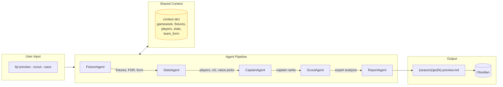
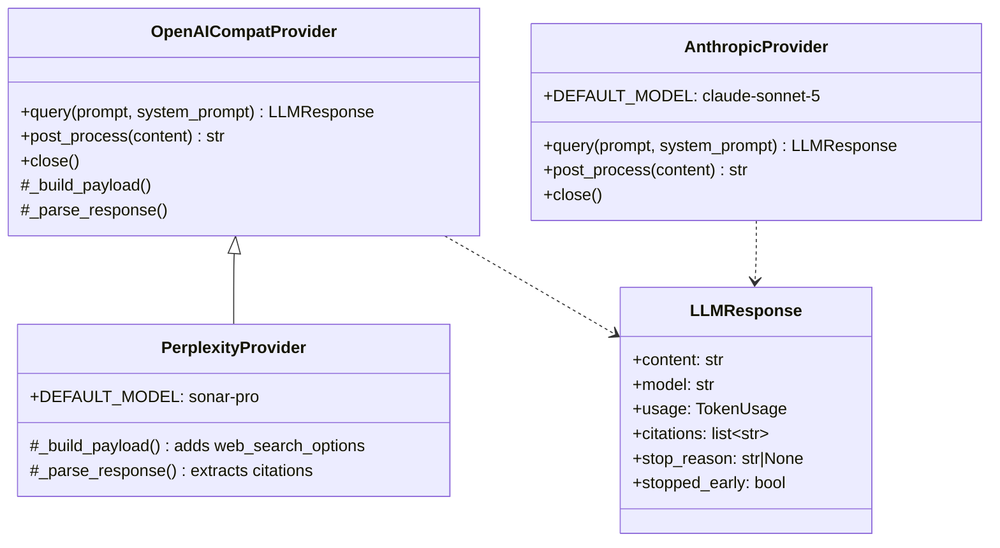
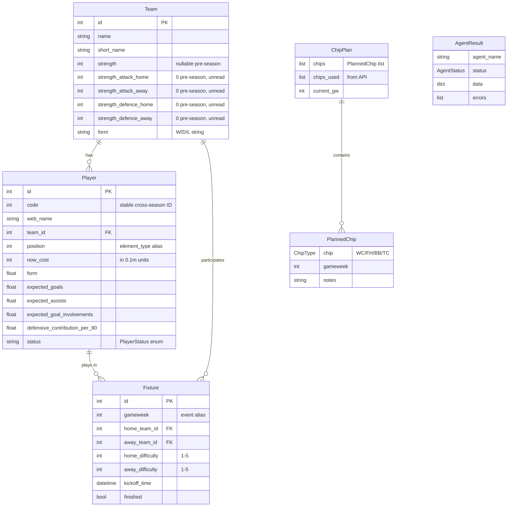
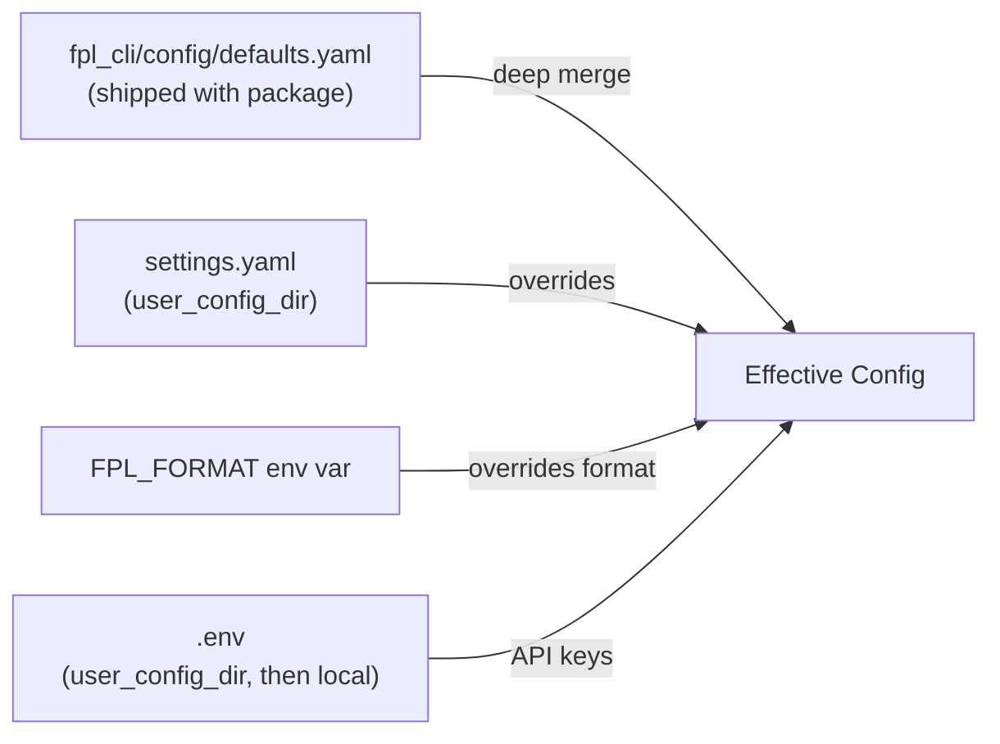

# FPL CLI Architecture

System design and module structure for contributors. For scoring formulas and methodology, see the [Custom Analysis Guide](custom-analysis.md). For command usage, see the [Command Reference](command-reference.md).


```mermaid
flowchart TB
    subgraph CLI["CLI Layer"]
        cli[cli/__init__.py<br/>FormatAwareGroup]
        ctx[_context.py<br/>Format detection]
        helpers[_helpers.py / _json.py<br/>Display & JSON output]
    end

    subgraph Config["Configuration"]
        defaults[config/defaults.yaml]
        settings[~/...fpl-cli/settings.yaml]
        env[".env<br/>API Keys"]
    end

    subgraph Agents["Agent Layer"]
        subgraph DataAgents["Data Agents"]
            fixture[FixtureAgent]
            price[PriceAgent]
            scout[ScoutAgent]
        end

        subgraph AnalysisAgents["Analysis Agents"]
            stats[StatsAgent]
            captain[CaptainAgent]
            squad_analyzer[SquadAnalyzerAgent]
            bench[BenchOrderAgent]
            starting_xi[StartingXIAgent]
            transfer_eval[TransferEvalAgent]
        end

        subgraph ActionAgents["Action Agents"]
            waiver[WaiverAgent]
        end

        subgraph OrchAgents["Orchestration Agents"]
            report[ReportAgent]
        end
    end

    subgraph Services["Services (agent-reachable)"]
        scoring[scoring/<br/>Scoring engine package]
        player_prior[player_prior<br/>Bayesian early-season confidence]
        team_ratings[TeamRatingsService<br/>1-7 strength scale]
        matchup[matchup<br/>3-GW matchup scores]
        fixture_preds[FixturePredictionsService<br/>BGW/DGW predictions]
        team_form[team_form<br/>Form stats]
    end

    subgraph APIClients["API Clients"]
        fpl_client[FPLClient]
        draft_client[FPLDraftClient]
        understat_client[UnderstatClient]
        vaastav_client[VaastavClient]
        core_insights_client[CoreInsightsClient]
        historical_provider[HistoricalDataProvider]
        football_data[FootballDataClient]
    end

    subgraph LLMProviders["LLM Providers"]
        anthropic_prov[AnthropicProvider]
        openai_prov[OpenAICompatProvider]
        perplexity_prov[PerplexityProvider]
    end

    subgraph Scraper["Scraper"]
        scraper[FPLPriceScraper]
    end

    subgraph Models["Data Models"]
        player_m[Player]
        fixture_m[Fixture]
        team_m[Team]
        chip_plan[ChipPlan]
        result_m[AgentResult]
        types_m[TypedDicts<br/>CaptainCandidate, WaiverTarget,<br/>EnrichedPlayer, etc.]
    end

    subgraph Prompts["Prompts"]
        scout_p[scout.py]
        review_p[review.py]
        recap_p[league_recap.py]
    end

    subgraph Templates["Jinja2 Templates"]
        preview_tmpl[gw_preview.md.j2]
        review_tmpl[gw_review.md.j2]
        recap_tmpl[gw_league_recap.md.j2]
    end

    subgraph External["External Services"]
        fpl_api[("FPL API")]
        draft_api[("Draft API")]
        understat_web[("understat.com")]
        vaastav_gh[("vaastav/FPL<br/>GitHub")]
        core_insights_gh[("Core-Insights/FPL<br/>GitHub")]
        football_api[("football-data.org")]
        llm_apis[("Claude / OpenAI /<br/>Perplexity APIs")]
        fpl_web[("FPL Website")]
    end

    subgraph Output["Output"]
        console[Rich Console]
        obsidian[("Obsidian Vault<br/>01_Reports/{season}/")]
    end

    %% CLI connections
    cli --> ctx
    cli --> helpers
    cli --> defaults & settings & env
    cli --> DataAgents & AnalysisAgents & ActionAgents & OrchAgents

    %% Agent -> Service connections
    fixture --> team_ratings & fixture_preds & matchup
    captain --> scoring
    bench --> scoring
    starting_xi --> scoring
    transfer_eval --> scoring
    stats --> scoring
    waiver --> scoring
    scout --> Prompts

    %% Agent -> API connections
    fixture --> fpl_client
    price --> fpl_client
    stats --> fpl_client
    scout --> LLMProviders
    captain --> fpl_client
    squad_analyzer -->|"get_player_detail()"| fpl_client
    bench --> fpl_client
    starting_xi --> fpl_client
    transfer_eval --> fpl_client
    waiver --> draft_client & fpl_client

    %% Service -> API connections
    player_prior --> historical_provider
    historical_provider --> vaastav_client
    historical_provider --> core_insights_client
    scoring --> player_prior
    team_ratings --> understat_client
    team_ratings --> football_data

    %% Orchestration
    report --> Templates --> obsidian
    report --> console

    %% LLM Provider connections
    anthropic_prov & openai_prov & perplexity_prov --> llm_apis

    %% API Client -> External
    fpl_client --> fpl_api
    draft_client --> draft_api
    understat_client --> understat_web
    vaastav_client --> vaastav_gh
    core_insights_client --> core_insights_gh
    football_data --> football_api
    scraper --> fpl_web

    %% Models
    Agents -.-> Models
    Services -.-> Models

    %% Styling
    classDef cli fill:#e1f5fe,stroke:#01579b
    classDef data fill:#e8f5e9,stroke:#1b5e20
    classDef analysis fill:#fff3e0,stroke:#e65100
    classDef action fill:#ffebee,stroke:#b71c1c
    classDef orch fill:#e3f2fd,stroke:#0d47a1
    classDef service fill:#f1f8e9,stroke:#33691e
    classDef api fill:#fce4ec,stroke:#880e4f
    classDef external fill:#f5f5f5,stroke:#424242
    classDef output fill:#e8eaf6,stroke:#1a237e

    class cli,ctx,helpers cli
    class fixture,price,scout data
    class stats,captain,squad_analyzer,bench,starting_xi,transfer_eval analysis
    class waiver action
    class report orch
    class scoring,team_ratings,matchup,fixture_preds,team_form service
    class fpl_client,draft_client,understat_client,vaastav_client,core_insights_client,historical_provider,football_data,scraper,anthropic_prov,openai_prov,perplexity_prov api
    class fpl_api,draft_api,understat_web,vaastav_gh,core_insights_gh,football_api,llm_apis,fpl_web external
    class console,obsidian output
```

## Data Flow: Preview Pipeline


```mermaid
flowchart LR
    subgraph Input["User Input"]
        cmd["fpl preview --scout --save"]
    end

    subgraph Pipeline["Agent Pipeline"]
        direction TB
        A[FixtureAgent] -->|fixtures, FDR, form| B[StatsAgent]
        B -->|players, xG, value picks| C[CaptainAgent]
        C -->|captain ranks| D[ScoutAgent]
        D -->|expert analysis| E[ReportAgent]
    end

    subgraph Context["Shared Context"]
        ctx[("context dict<br/>gameweek, fixtures,<br/>players, stats,<br/>team_form")]
    end

    subgraph Output["Output"]
        file["{season}/gw{N}-preview.md"]
        vault[("Obsidian")]
    end

    Input --> Pipeline
    Pipeline <--> Context
    E --> file --> vault

    style ctx fill:#fff9c4,stroke:#f57f17
```

## Agent Inheritance


```mermaid
classDiagram
    class Agent {
        <<abstract>>
        +name: str
        +description: str
        +config: dict
        +run(context) AgentResult*
        +close()
        +validate()
        +log() / log_success() / log_warning() / log_error()
        #_create_result() AgentResult
    }

    class AgentResult {
        +agent_name: str
        +status: AgentStatus
        +data: dict
        +message: str
        +errors: list
        +timestamp: datetime
        +requires_approval: bool
        +pending_actions: list
        +success: bool
    }

    class AgentStatus {
        <<enumeration>>
        SUCCESS
        PARTIAL
        FAILED
        PENDING_APPROVAL
    }

    Agent --> AgentResult : returns
    AgentResult --> AgentStatus : has

    Agent <|-- FixtureAgent
    Agent <|-- PriceAgent
    Agent <|-- StatsAgent
    Agent <|-- ScoutAgent
    Agent <|-- CaptainAgent
    Agent <|-- SquadAnalyzerAgent
    Agent <|-- BenchOrderAgent
    Agent <|-- StartingXIAgent
    Agent <|-- TransferEvalAgent
    Agent <|-- WaiverAgent
    Agent <|-- ReportAgent
```

## CLI Command Mapping


```mermaid
flowchart LR
    subgraph Direct["Direct API Commands"]
        status["status"]
        doctor["doctor"]
        fixtures["fixtures"]
        player["player"]
        stats["stats"]
        history["history"]
        league["league"]
        price_hist["price-history"]
        chips["chips"]
        ratings["ratings"]
        intel["intel"]
        returnees["returnees"]
        credentials["credentials"]
        init["init"]
        fines["league-fines"]
    end

    subgraph ViaAgent["Agent-Backed Commands"]
        preview["preview"]
        review["review"]
        recap["league-recap"]
        cap["captain"]
        fdr["fdr"]
        xg["xg"]
        diff["differentials"]
        tgt["targets"]
        pr["price-changes"]
        waivers["waivers"]
        squad["squad"]
        transfer_eval["transfer-eval"]
    end

    subgraph Agents["Agents"]
        FA[FixtureAgent]
        PA[PriceAgent]
        SA[StatsAgent]
        SCA[ScoutAgent]
        CA[CaptainAgent]
        SQA[SquadAnalyzerAgent]
        WA[WaiverAgent]
        RA[ReportAgent]
        TEA[TransferEvalAgent]
    end

    subgraph Stores["Durable Stores"]
        LH[("league_history<br/>append-only ledger")]
        LHC[("league_history_counters<br/>rebuildable projection")]
        RS[("returnee_snapshot<br/>baseline + current state")]
    end

    preview --> FA & SA & CA & SCA & RA
    review --> RA
    recap --> RA
    recap -->|"records every run"| LH
    LH -->|"streaks, notes pack,<br/>season phase, season fines"| recap
    LH -->|"season fine tally"| fines
    LH -.->|"rebuilds when stale"| LHC
    returnees -->|"stores the watchlist it showed"| RS
    RS -->|"week-over-week transitions"| returnees
    cap --> CA
    fdr --> FA
    xg --> SA
    diff --> SA
    tgt --> SA
    pr --> PA
    waivers --> WA
    squad --> SQA
    transfer_eval --> TEA

    style Direct fill:#e8f5e9,stroke:#1b5e20
    style ViaAgent fill:#fff3e0,stroke:#e65100
    style Stores fill:#ede7f6,stroke:#311b92
```

### Format Awareness

Commands are classified by format applicability:

| Category | Commands |
|---|---|
| **Classic only** | `captain`, `targets`, `differentials`, `chips`, `credentials` |
| **Draft only** | `waivers` |
| **General** | Everything else (format-gated sections within) |

`FormatAwareGroup` auto-hides inapplicable commands in `--help` based on configured format. Format resolved from settings (`classic_entry_id` / `draft_league_id`) or `FPL_FORMAT` env var.

### Custom Analysis Gating

Commands are independently classified by the `custom_analysis` toggle:

| Category | Commands | When opted out |
|---|---|---|
| **Pure-experimental** | `captain`, `targets`, `differentials`, `waivers`, `allocate`, `transfer-eval`, `ratings` | Unregistered from CLI |
| **Mixed** | `stats`, `xg`, `fdr`, `fixtures`, `player`, `preview` | Experimental columns/sections stripped |
| **Data-only** | Everything else | No change |

`FormatAwareGroup.list_commands()` and `get_command()` filter out the `EXPERIMENTAL` frozenset when `custom_analysis` is off. Mixed commands ask the same question through `_context.py`: `custom_analysis_enabled(ctx)` when the toggle is all they need from the settings (`fdr`, `fixtures`, `xg`), or `is_custom_analysis_enabled(settings)` on the dict `get_settings(ctx)` already gave them when they read other keys too (`stats` needs `rolling_window`, `player` and `preview` the configured entry IDs). Resolving settings at the call site instead is banned by a lint rule — see [Config Resolution](#config-resolution). Both filters (format and experimental) are independent and must both pass.

## Services Layer

Services live in `fpl_cli/services/` and provide the computation layer between agents and API clients. For scoring formulas, weight definitions, and methodology detail, see the [Custom Analysis Guide](custom-analysis.md#services-overview).

| Service | Purpose |
|---|---|
| `scoring/` | Central scoring engine, a package with the public API re-exported from its root (agents import `fpl_cli.services.scoring`). `constants` holds every weight set, ceiling, and consistency magnitude — the ownership/value normalisation ceilings are empirically calibrated per (family, position) by `scripts/calibrate_quality_ceilings.py` (a generated `QUALITY_CEILINGS` block plus a fingerprint of every scoring input; a drift-guard test fails when weights change without recalibration; `ceiling_attainability()` returns the share of a ceiling's budgeted headroom an input can actually reach, from the weight caps of the terms it can supply; `gk_ceiling_attainability()` is its calendar-keyed special case, scaling the GK anchors' ramped-signal share by the calendar-possible share of the enrichment's 450-minute sample ramp — identity from GW6, uniform across keepers at a gameweek, and only on paths whose numerators carry the GK signals — issue #143; the returnee radar is the other caller, for terms a historical season's source never recorded — issue #132); `data_prep` holds `prepare_scoring_data()`; `evaluation` builds enrichment and `PlayerEvaluation`/`PlayerIdentity`, and owns the GK signal block (`gk_signal_enrichment()` derives saves/90, xGC quality and CS rate from season aggregates; `apply_gk_signals()` is the shared merge every keeper-scoring path calls — same shape as `apply_adjusted_npxg()`/`apply_consistency()`, but it lives here rather than in `signals` because `evaluation` already imports `signals`, and it returns whether the block landed so a caller knows if the calibrated GK anchor may be calendar-scaled — issue #207); the scoring families split into `value_quality` (quality baseline + `compute_quality_value()` + the GW1-9 prior blend `blend_quality_with_prior()`, which replaces position-mean shrinkage for the value *and* ownership families — the observed raw score blended with `prior_strength × anchor × CALIBRATION_ELITE_TARGET` weighted by the stored confidence for every position (a keeper-specific `gk_calendar_ramp()` discount was evaluated and dropped in review: the discounted share can only move onto the prior, unevenly across positions on the allocator's summed objective), with the same known-unavailable hold-out; backtested by `scripts/backtest_early_season_prior_blend.py --family ...` through the production function, against pure observation for the value family and against `shrink_scores` for the ownership ones — issues #143 and #206), `ownership` (target/differential/waiver; it runs the blend on its *quality baseline* only, before the matchup, ownership, position-need and consistency bonuses, so `_ownership_anchor_for()` supplies the ceiling without that headroom — a prior models a player's pedigree, not the fixtures in front of them, and the anchor has to be the scale an elite baseline reaches), and `single_gw` (captain/bench/lineup/XI, the one family still shrinking); `display` owns 0-100 normalisation and `pick_display_ceiling()`; `shrinkage` owns `shrink_scores()` (the single-GW family) plus the hold-out helpers (`is_known_unavailable()` / `unavailable_player_ids()`) that keep players known not to be playing out of the position means, out of the adjustment, and out of the blend. `signals` holds the form modifiers — `compute_form_trajectory()` (direction over recent GWs) and `compute_xgi_sustainability()` (ATK-only rolling xGI divergence -> [0.85, 1.15] multiplier) — plus fixture-adjusted npxG (`compute_adjusted_npxg()` / `build_adjusted_npxg_lookup()` normalise historical xG by opponent Elo; `apply_adjusted_npxg()` overwrites `npxG_per_90` in agent enrichment when data is available) and consistency signals (`build_consistency_lookup()` computes 5 per-player signals — CV-xGI percentile, blank rate, floor percentile, involvement rate, GK consistency — with GW6-10 phase-in; additive bonuses per scoring family: target/waiver cv*1.5, differential inverted cv*0.75, lineup cv*0.75, bench floor*1.5+inv*0.75) |
| `player_prior` | Bayesian early-season confidence (GW1-10): the value family blends it into `quality_score` and the ownership family into the quality baseline of its target/differential/waiver scores, while the single-GW family shrinks toward position means with it. `load_or_generate_player_priors()` is the single entry point (cache, else generate and cache, else `None` for graceful degradation), shared by `prepare_scoring_data` and the `fpl stats --value` / `fpl player` commands, which need it because the blend lives inside `compute_quality_value`; `early_season_quality_warning()` is the one notice every prior-blended surface carries in `metadata.warnings` — the value family (`fpl stats --value`, `fpl player`, `fpl allocate`), the ownership family (`fpl targets`, `fpl differentials`, `fpl waivers`) and `fpl transfer-eval`, which shows one score from each — keyed on whether the priors loaded so a blended score is distinguishable from a degraded pure-observation one, and taking `score_names` so it points at the fields the caller actually shows rather than at `quality_score` on a page without one (its single-GW siblings are never named: they still shrink). The via-agent commands decide it in the agent, because only the agent knows whether the priors loaded, and the command routes it to `metadata.warnings` in JSON or stderr in table mode; threads `PlayerProfile.reliability` (historical availability rate) through `PlayerPrior` to agents |
| `team_ratings` | TeamRatingsService + Calculator (1-7 scale, 4 axes). `seed_from_prior()` rebuilds from the previous-season prior instead of serving last season's table whenever the current season cannot rate teams: pre-season, and again in the gap after GW1 kicks off, where the pre-season branch has closed but `calculate_from_fixtures()` still returns nothing (it needs a home *and* an away result per club) — without the second case every fixture fell through to a neutral 4.0. Season-aware: a file stamped (or dated) to a previous season is ignored rather than served, taking its `based_on_gws` with it so a new season recalculates. `check_team_set()` diffs the rated clubs against `bootstrap-static` and names the promoted clubs missing and the relegated ones still rated — the check that catches a rollover a date cannot. `has_ratings` / `is_uniform` / `is_preseason_estimate` flag rating sets that cannot produce meaningful fixture difficulty; every warning surfaces via `get_staleness_warning()`. `get_positional_fdr()`, `get_positional_fdr_pair()` (each column rounded to 1dp — the one rounding boundary) and `get_fixture_fdr()` (that pair's mean) are the only definitions of a fixture's difficulty — the agent and the direct-api `fpl fixtures` both call them, so a match cannot carry two numbers (#202) and the general figure is always the mean of the columns printed beside it; all three FDR surfaces follow the `custom_analysis` toggle to the FPL API's 1-5 difficulty together |
| `matchup` | Fixture matchup scoring (0-10), 3-GW recency-weighted |
| `fixture_predictions` | BGW/DGW predictions from YAML + live detection. `find_blank_gameweeks()` answers "did this club play" from the club a player is at *now*, which is all the bootstrap knows; `resolve_players_with_fixture()` answers it from the gameweek itself, reading the live payload's per-club-fixture `explain` entries, and `had_fixture()` prefers that answer and falls back to the club when the gameweek cannot give one (unstarted, part-played, or a payload whose `explain`s have not populated). `find_double_gameweeks()` / `resolve_players_with_double()` / `is_double_gameweek()` are the same three off the same signal, counting the `explain` entries rather than testing for one. `is_blank_gameweek()` is `had_fixture()` inverted, for callers populating a `bgw` field. Anything reading a past gameweek needs the point-in-time answers: a player transferred since carries his current club's fixtures, not the ones he actually had (issues #169, #174) |
| `season_previews` | Hand-curated per-team season intel from `<config dir>/previews/*.yaml`. Per-section decay (`SECTION_DECAY`) ages each kind of claim out at the gameweek something better supersedes it — injuries at GW2, projected XIs at GW7, team strength at GW13 to mirror `team_ratings_prior.BLENDING_CUTOFF_GW`. `coverage()` centralises the usage gate (`full` / `negative_filter_only` / `none`) so the three consuming skills cannot drift apart on the threshold. Deterministic name resolution (`resolve_name`) matches preview prose to `element_code`, reporting ambiguity rather than guessing; `write_resolved_codes` saves via round-trip YAML so hand-written comments survive |
| `squad_allocator` | ILP squad allocator (PuLP CBC), horizon-aware, chip-aware |
| `returnee_radar` | Injury returnee radar behind `fpl returnees`. Parses the FPL `news` grammar into a `ReturnSignal` (four shapes, only two of them dated), filters on a window and a **source-aware** quality bar, and diffs the result against a persisted snapshot for week-over-week transitions. The bar is source-aware because `player_prior` only assigns `source="history"` at 450+ minutes in the previous season and caps `prior_strength` at 0.5 on the `"price"` fallback, so one flat threshold would exclude exactly the players who missed most of last season through injury: history-sourced players are gated on `prior_strength`, price-sourced ones are scored through `value_quality` over their most recent season carrying real minutes, and the within-position price percentile is the last resort. That season supplies the DEF/GK weight terms (defensive contribution, saves, clean sheets, xGC per 90) from the `SeasonHistory` row when its source published them, and otherwise shrinks the ceiling via `ceiling_attainability()` rather than reading the gap as a measured zero — without which no keeper and effectively no defender could clear the bar (#132). `run_radar()` is the public entry point (snapshot I/O included); `build_radar()` is the pure core. The `SnapshotStore` behind it holds two states — the baseline every run in the current gameweek diffs against, and the current gameweek's own, promoted to baseline when the gameweek moves on — so a second run in one gameweek reports the same transitions as the first instead of diffing against what that run just stored (#225). **Fetches nothing** — the caller injects historical profiles and Understat season data, because `prepare_scoring_data` discards the profiles it built priors from and skips fetching them at all on a cache hit. Optional AI-search enrichment (`--enrich`) attaches an `EnrichedReturn` beside the FPL signal, never over it, and only a *cited* enriched date can decide an escalation |
| `team_form` | Rolling team form stats (last 6 matches, venue splits) |
| `league_history` | Durable league-history ledger: one NDJSON file per gameweek under `<data dir>/league_history/<season>/<format>-<league id>/`, written as a side effect of `league-recap`. Append-only — an identical row writes nothing, a differing one appends a superseding line, and readers resolve by highest fidelity tier then latest capture, with an unknown row ranking below every tier. Each row carries its own schema version: an older one is upgraded in memory on read (the line on disk is never rewritten, so a store shared with an older install stays readable by it), a newer one is skipped with a warning and preserved byte-for-byte. Two deliberate inversions of house convention: loading **fails closed** (unlike `chip_plan`, which resets on a corrupt file) because the API cannot rebuild a past gameweek — scoped to that one gameweek, whose coverage entry carries the file path and the `mv` that retires it, so a caller reports it as `league_history_store_unreadable` rather than as a coverage gap `--backfill-detail` would refuse to fill, and reports it once per run however many of a recap's readers hit the same file — and season is a **partition key** (unlike `team_ratings`, which discards a previous season) because per-gameweek granularity is destroyed at the July rollover. The consequence of partitioning is that the store only ever grows — nothing prunes a prior season, by design — at roughly a few megabytes per league per season |
| `league_history_counters` | Declarative streak-condition registry (9 conditions: `weeks_on_top`, `bottom_half_run`, `gw_win_streak`, `gw_loss_streak`, `green_arrow_drought` shared; `captain_blank_run`, `hit_run` classic-only; `waiver_win_run`, `waiver_burn_run` draft-only) and the rebuildable counters projection it drives. Each entry declares the minimum run worth surfacing as a streak, `None` for the two conditions (bottom half, green-arrow drought) whose run only drives their season count's firing rule. Each predicate returns extend/reset/hold for one manager's row — hold on an unknown row, a fixture-less blank, a gameweek the condition does not apply to, or one it structurally could not have ruled (a green-arrow drought holds for a gameweek that began in first place, where climbing was impossible), so neither a capture gap nor an impossibility ever lies about a streak in either direction. Alongside each currently-open run, the state carries season-wide occurrence totals (issue #164): every extending gameweek counts once and survives a reset, holds are tallied separately as the count's "not judged" qualifier, and the last-occurrence and first-evaluated gameweeks bound what a consumer may claim — so "their sixth gameweek win of the season" is derivable, not just the open run. Each entry also declares a `CountSurfacePolicy`, the condition's own rule for when that total is worth rendering weekly (U9 applies it; the milestone set-pieces and `--format json` ignore it). The projection is a disposable cache (never a second source of truth) under `<data dir>/league_history_counters/<season>/<format>-<league id>/counters.json`: it advances one gameweek at a time when its stamp is exactly one behind, and **fails open** to a full rebuild from `league_history`'s rows otherwise — missing, unreadable, wrong-version, or a stamp that isn't stamp+1 (which is also what makes the season totals retroactive: the version bump that added them rebuilds silently from rows already on disk) |
| `league_history_fines` | Season fine tally (`build_season_fines_tally()`): a pure fold over `league_history`'s rows into per-manager, per-rule counts, with no cache and no second source of truth. Counts only what a row already recorded, so a settings change moves future rulings and leaves history alone — a guarantee `_freeze_recorded_fines` (`cli/_league_recap_history.py`) carries into backfill, where a repair would otherwise re-rule an unchanged cohort under whatever config is current at repair time. Every gameweek that could not be ruled is named as a qualifier rather than folded in as a zero — never captured, unreadable, captured but reaching nobody (every row unknown), holding no record of what was ruled (schema version < 4, or an evaluation that raised), recording a ruling on no rules at all, or captured at a fidelity that could not rule a given rule. Each qualifier states only what the ledger can prove: where two causes are indistinguishable from a row, neither is named. A mid-season joiner keeps their real, lower totals and is qualified; a manager who has since left keeps the fines already ruled against them, bounded to the gameweeks they were recorded for. Rulings are tracked per rule as well as per manager (`unruled_gameweeks_for()`), since a coarse gameweek rules `last-place` and structurally cannot rule `red-card` — the recap prompt asks that question before it will call a fine a manager's first of the season |
| `league_history_notes` | Notes pack (`build_notes_pack()`), season-phase marker (`derive_season_phase()`, standalone) and the `is_season_milestone()` predicate the recap gates its *printed* season fines table on (its prompt section is ungated) - the phase's *first* gameweek and the finale, deliberately not the whole 13-gameweek midpoint phase, since a once-a-season set-piece fired thirteen times is wallpaper built from `league_history_counters`'s projection plus a bounded trailing window of raw ledger rows (`TRAILING_WINDOW_GAMEWEEKS = 6`, reused as the run-in phase's own length). Every open streak renders as an observed count over its true span rather than "in a row" once any gameweek held (e.g. "3 in the last 11, with 8 not recorded"); each entry declares which of console/report/prompt it reaches — a reportable streak reaches all three, coverage statements reach report+prompt, the season-phase marker is prompt-only (scene-setting for the editorial, never printed in the report — issue #187), and a below-minimum streak is retained (exposed via `--format json`) with no surfaces. Season-count entries (issue #164) render each condition's season occurrence total over the manager's own evaluated span, with holds stated as "not judged either way", surfaced per the registry's own declarative `CountSurfacePolicy` (a step the total must land on, run-length milestones read off the open run rather than the total, a first-occurrence rule gated on the season's half, a whole-condition second-half gate, and a ride-along rule for same-gameweek peers — an absolute floor for counts that stay small, a window relative to the nearest firing total for counts that climb all season). Evaluation is two-pass because firing is cross-manager: who fired their condition this gameweek, then which same-gameweek incrementers ride along beside them. Every nonzero count is retained for `--format json`, and at the two `is_season_milestone()` gameweeks the whole nonzero set carries report+prompt — the report's `## Season Counts` set-piece and the retrospective editorial's season-spanning facts. A "since GW X" qualifier is stated only when a partition's or a specific manager's own recorded coverage genuinely begins later than the league's start gameweek, never merely because a trailing window was read. Only the finale phase rescans every captured gameweek (via `rebuild_counters_through`, never the cached `compute_counters_through`) so weekly cost stays flat as the season progresses |

## LLM Provider Abstraction


```mermaid
classDiagram
    class LLMResponse {
        +content: str
        +model: str
        +usage: TokenUsage
        +citations: list~str~
        +stop_reason: str|None
        +stopped_early: bool
    }

    class OpenAICompatProvider {
        +query(prompt, system_prompt) LLMResponse
        +post_process(content) str
        +close()
        #_build_payload()
        #_parse_response()
    }

    class PerplexityProvider {
        +DEFAULT_MODEL: sonar-pro
        #_build_payload() adds web_search_options
        #_parse_response() extracts citations
    }

    class AnthropicProvider {
        +DEFAULT_MODEL: claude-sonnet-5
        +query(prompt, system_prompt) LLMResponse
        +post_process(content) str
        +close()
    }

    OpenAICompatProvider <|-- PerplexityProvider
    OpenAICompatProvider ..> LLMResponse
    AnthropicProvider ..> LLMResponse
```

All providers share the `LLMResponse` contract. `OpenAICompatProvider` supports OpenAI, Groq, Together, Ollama via configurable `base_url`. Provider selection configured in settings.

`stop_reason` carries the provider's own verdict on why generation ended, verbatim in whichever vocabulary it used — Anthropic's `stop_reason`, an OpenAI-compatible API's `finish_reason`. `stopped_early` reads it against `NORMAL_STOP_REASONS`, a single set covering both dialects (the vocabularies do not collide), and every provider announces an abnormal one at WARNING via `log_abnormal_stop` — the same reason `_http` announces its retries there, so a truncation is visible on any command that talks to an LLM. `None` means the provider said nothing, which is never treated as evidence of truncation. Without this a cut-off response and a complete one were indistinguishable downstream, which is how a saved gameweek review shipped missing a whole format's verdict at exit 0 (#266).

Both HTTP providers post through `_http.post_json_with_retry`, the one place their error handling lives: it retries an HTTP 429 with `RetryPolicy` (exponential backoff with jitter, `Retry-After` honoured, the whole wait bounded by one budget, each retry announced at WARNING) and raises `RateLimitError` — a `ProviderError` subclass carrying the server's `retry_after` — once the attempts are spent, and turns every other error status, a timeout, or a non-JSON body into a sanitised `ProviderError`. That is the same 429-is-transient distinction `DatasetFetcher` draws for the historical datasets. The module also holds `QueryPacer`, which keeps request starts a configured interval apart for a caller that fires several queries at once; `fpl returnees --enrich` pairs it with an in-flight cap, reads the typed error to re-query only the rate-limited subset of its shortlist once, and reports a still-refused player as rate-limited rather than unanswered.

## API Clients

| Client | External Source | Purpose |
|---|---|---|
| `FPLClient` | FPL API | Players, fixtures, managers, teams, bootstrap-static (cached) |
| `FPLDraftClient` | FPL Draft API | Draft leagues, waivers, squad data |
| `UnderstatClient` | understat.com | npxG, xA, xGChain, xGBuildup per-90 stats; per-team match xG via `get_team()`, which keeps only the season it asked for (`matches_in_season()`) because understat.com answers a season a club has no record of with that club's most recent one — for a promoted club, the season in progress (#235) |
| `VaastavClient` | vaastav/FPL GitHub | Historical CSV data for the two oldest seasons of the four-season window, price trends, GW-level profiles |
| `CoreInsightsClient` | Core-Insights/FPL GitHub | CSV data for last season and the season in progress (all Core-Insights publishes): season aggregates for both, plus current-season GW trends and per-GW match-level xG + Elo (from `By Tournament/Premier League/GW{n}/`) |
| `HistoricalDataProvider` | Composition layer | Unifies vaastav + Core-Insights via `make_historical_provider()`: `historical_season_windows()` allocates the four-season window between them so they never overlap, and `merge_season_histories()` keeps one row per `(element_code, season)` with Core-Insights outranking vaastav if they ever do |
| `FootballDataClient` | football-data.org | League standings, match results |
| `FPLPriceScraper` | FPL website | Price change scraping (needs credentials) |

## Model Relationships


```mermaid
erDiagram
    Player ||--o{ Fixture : "plays in"
    Team ||--o{ Player : "has"
    Team ||--o{ Fixture : "participates"

    Player {
        int id PK
        int code "stable cross-season ID"
        string web_name
        int team_id FK
        int position "element_type alias"
        int now_cost "in 0.1m units"
        float form
        float expected_goals
        float expected_assists
        float expected_goal_involvements
        float defensive_contribution_per_90
        string status "PlayerStatus enum"
    }

    Fixture {
        int id PK
        int gameweek "event alias"
        int home_team_id FK
        int away_team_id FK
        int home_difficulty "1-5"
        int away_difficulty "1-5"
        datetime kickoff_time
        bool finished
    }

    Team {
        int id PK
        string name
        string short_name
        int strength "nullable pre-season"
        int strength_attack_home "0 pre-season, unread"
        int strength_attack_away "0 pre-season, unread"
        int strength_defence_home "0 pre-season, unread"
        int strength_defence_away "0 pre-season, unread"
        string form "W/D/L string"
    }

    ChipPlan {
        list chips "PlannedChip list"
        list chips_used "from API"
        int current_gw
    }

    ChipPlan ||--o{ PlannedChip : "contains"

    PlannedChip {
        ChipType chip "WC/FH/BB/TC"
        int gameweek
        string notes
    }

    AgentResult {
        string agent_name
        AgentStatus status
        dict data
        list errors
    }
```

## Module Map

```
fpl_cli/
├── cli/                          # Click commands & groups
│   ├── __init__.py               # main() entry point, command registration
│   ├── _context.py               # Format enum, CLIContext, FormatAwareGroup (format + experimental gating), settings loader, ctx accessors (get_format/get_settings/custom_analysis_enabled/settings_block/fpl_config)
│   ├── _helpers.py               # Shared display utilities
│   ├── _json.py                  # JSON output serialisation
│   ├── _banner.py                # Startup banner
│   ├── _plan_grid.py             # Fixture grid rendering
│   ├── _review_*.py              # Review command helpers (analysis, classic, draft, summarisation)
│   ├── _league_recap_*.py        # League recap helpers & types (`_league_recap_history.py` orchestrates capture: builds ledger rows, corrects previous league position from recorded rows, runs the two-tier backfill including the coarse tier's partial fine ruling, keeps the name/club/position a replayed gameweek already recorded rather than restamping it from today's bootstrap (`_carry_recorded_identity`, reading the earliest recorded line rather than the resolved winner so an already-restamped gameweek is repaired), keeps the league position and cumulative total the same way (`_carry_recorded_standings`) and reconstructs a draft gameweek's from the ledger where it can (`_fill_draft_standings`), sweeps already-damaged gameweeks back into shape without re-fetching anything (`_repair_recorded_standings`), and returns the notes pack and season fine tally the console, report, prompt and JSON payload all read)
│   ├── _fines.py / _fines_config.py  # League fines system, including the cohort-only/needs-a-squad rule split the coarse ledger tier narrows by
│   ├── league_fines.py           # `league-fines`: season fine table read straight off the ledger, no network
│   ├── doctor_providers.py       # Live provider probes for `doctor --providers` (shape/volume/join checks; the Core-Insights per-GW probe runs the real parsers, so it cannot pass a file the runtime reads as zero records, and the Understat name-join probe runs the real matcher, so a club resolving cannot stand in for its players joining)
│   └── [command files]           # One file per command/group
├── agents/
│   ├── base.py                   # Agent ABC, AgentResult, AgentStatus
│   ├── common.py                 # Shared: enrich_player, fetch_understat_lookup, draft helpers
│   ├── data/                     # FixtureAgent, PriceAgent, ScoutAgent
│   ├── analysis/                 # StatsAgent, CaptainAgent, SquadAnalyzerAgent, BenchOrderAgent, StartingXIAgent, TransferEvalAgent
│   ├── action/                   # WaiverAgent
│   └── orchestration/            # ReportAgent
├── api/
│   ├── contract.py               # Runtime tripwires: CSV header checks + empty-output warnings for dataset drift
│   ├── dataset_fetcher.py         # DatasetFetcher (disk cache with ETag/TTL for GitHub CSVs)
│   ├── fpl.py                    # FPLClient (main API, caches bootstrap-static)
│   ├── fpl_draft.py              # FPLDraftClient + match_draft_to_main()
│   ├── understat.py              # UnderstatClient + match_fpl_to_understat(), understat_club_rows() (the club gate the matcher and `fpl doctor --providers` share), understat_join_warnings(), understat_name_join_stats() (the name-level join rate, the signal a silently unmatched player had none of), decode_entities() (Understat escapes its payload for HTML, so it is decoded once at the fetch boundary), matches_in_season() (the season guard behind get_team())
│   ├── historical_types.py       # Shared dataclasses (SeasonHistory — incl. the four optional per-90 DEF/GK rates only Core-Insights publishes, PlayerProfile, GwTrendProfile) + compute_trend/compute_acceleration/compute_reliability
│   ├── vaastav.py                # VaastavClient (the two oldest seasons of the window via DatasetFetcher)
│   ├── core_insights.py          # CoreInsightsClient (last season + the season in progress via DatasetFetcher)
│   ├── historical.py             # HistoricalDataProvider (composition: vaastav + Core-Insights) + historical_season_windows() (the disjoint source allocation) + merge_season_histories()
│   ├── football_data.py          # FootballDataClient (standings, match results)
│   └── providers/                # LLM provider abstraction
│       ├── _models.py            # LLMResponse (incl. stop_reason/stopped_early), TokenUsage, NORMAL_STOP_REASONS, log_abnormal_stop, ProviderError, RateLimitError
│       ├── _http.py              # Shared HTTP plumbing: 429 backoff (RetryPolicy, post_with_retry), the providers' one error path (post_json_with_retry), QueryPacer for batching callers
│       ├── anthropic.py          # AnthropicProvider
│       ├── openai_compat.py      # OpenAICompatProvider (OpenAI, Groq, Together, Ollama)
│       └── perplexity.py         # PerplexityProvider (extends OpenAICompat)
├── services/
│   ├── scoring/                  # Central scoring engine package (public API re-exported from __init__)
│   │   ├── constants.py          # Weights, ceilings, position multipliers, consistency magnitudes
│   │   ├── signals.py            # Form trajectory, xGI sustainability, consistency, adjusted npxG
│   │   ├── evaluation.py         # Enrichment assembly + PlayerEvaluation / PlayerIdentity
│   │   ├── value_quality.py      # Quality baseline + VALUE family (compute_quality_value)
│   │   ├── ownership.py          # Target / differential / waiver formulas
│   │   ├── single_gw.py          # Captain / bench / lineup / starting XI formulas
│   │   ├── display.py            # 0-100 normalisation + display ceiling routing
│   │   ├── shrinkage.py          # Single-GW early-season shrinkage + the shared hold-out helpers
│   │   └── data_prep.py          # ScoringContext / ScoringData + prepare_scoring_data()
│   ├── player_prior.py           # Player prior (Bayesian early-season confidence)
│   ├── team_ratings.py           # TeamRatingsService + Calculator (1-7 scale)
│   ├── team_ratings_prior.py     # Previous-season prior + Bayesian blending (cutoff GW12); every pool it reads (the PL pool from either source, the Championship division) takes full-season records only, and every club's basis is written to the cache as `inputs`. The cache is invalidated by the methodology version, the league's club list, and a one-directional provenance check (`_inputs_have_improved`) that rebuilds only when an input the cached run lacked is available now — so setting `FOOTBALL_DATA_API_KEY` reaches the promoted sides without the file being deleted (#112)
│   ├── matchup.py                # Fixture matchup scoring (0-10)
│   ├── fixture_predictions.py    # BGW/DGW predictions from YAML + live detection, plus the point-in-time "did his club have a fixture, and how many" read a past gameweek needs
│   ├── season_previews.py       # Per-team season intel: schema, per-section decay, coverage gate, name resolution
│   ├── squad_allocator.py        # ILP squad allocator (PuLP CBC) - score, fixture coefficients, solver. Horizon-aware: horizon=1 uses single-GW scoring (GW_SELECTION_WEIGHTS), horizon>=2 uses ownership-family quality (VALUE_QUALITY_WEIGHTS). Chip-aware: --bench-discount (Free Hit), --bench-boost-gw (Bench Boost per-GW override to 1.0), --sell-prices (WC/FH sell-price budget correction via price_overrides dict)
│   ├── returnee_radar.py         # Injury returnee radar: FPL news grammar -> ReturnSignal, source-aware quality bar, window filter, snapshot diff, optional AI-search enrichment. Pure core (build_radar) + I/O entry point (run_radar); fetches nothing itself
│   ├── team_form.py              # Rolling team form stats
│   ├── league_history.py         # League history ledger store: per-gameweek NDJSON, fail-closed load, supersession, coverage query
│   ├── league_history_counters.py # Streak-condition registry (9 conditions, extend/reset/hold predicates) + rebuildable counters projection: own version + computed-through-gameweek stamp, fails open to a full rebuild from league_history. State carries both the open run and reset-surviving season occurrence totals with a held-gameweek tally
│   ├── league_history_fines.py   # Season fine tally (build_season_fines_tally): per-manager, per-rule counts folded straight off the ledger, plus honest coverage qualifiers. No cache, no re-ruling
│   └── league_history_notes.py   # Notes pack (build_notes_pack) + derive_season_phase() + is_season_milestone(): per-manager streak factoids in observed-count phrasing, season-count factoids (surfaced per each condition's own CountSurfacePolicy — who fired it this gameweek plus qualifying ride-alongs; full set at the two milestones), season-phase marker, coverage/"since GW X" statements. Counters projection + a bounded trailing window of rows; full season only at the finale
├── models/
│   ├── player.py                 # Player, PlayerStatus, PlayerPosition, POSITION_MAP, BLANK_POINTS_THRESHOLD, name resolution (`resolve_players` / `resolve_player`, `AmbiguousPlayerError`, and the `_or_report` pair every name-taking command and script shares)
│   ├── team.py                   # Team
│   ├── fixture.py                # Fixture
│   ├── chip_plan.py              # ChipPlan, ChipType, PlannedChip, UsedChip
│   ├── league_history.py         # LeagueHistoryRow + Ledger* sub-models, CaptureStatus, FidelityTier, schema version constants (v4 adds `fine_rules_evaluated`, which tells an unfined gameweek from an unruled one); ConditionRunState + LeagueHistoryCountersProjection for the counters cache; ManagerEarliestGameweekCache for the first-captured-gameweek memo
│   └── types.py                  # TypedDicts: CaptainCandidate, WaiverTarget, EnrichedPlayer, etc.
├── prompts/
│   ├── scout.py                  # ScoutAgent system/user prompts
│   ├── review.py                 # Review research + synthesis prompts. Squad and transfer lines in the synthesis data block carry each player's full club name, and the hard constraints bind club affiliation and blanket scored/blanked claims to that supplied data — an LLM's own club knowledge goes stale every transfer window. Also the synthesis half's post-generation guard (`check_synthesis_completeness`, `required_synthesis_sections`), which reads the required `## ` headings back off the prompt that was actually sent rather than restating them as a constant
│   ├── returnees.py              # Return-intel search prompt for `fpl returnees --enrich` (one player per query, so a citation list belongs to a single player)
│   └── league_recap.py           # League recap synthesis prompts, including the anchored League History section, its never-infer-history rule (emitted even when the pack is empty), and the season-phase framing instruction. The GW Standings section leads with an explicit "Previous gameweek's leader" fact (issue #189) so a "topped the table"/"fell from the top" claim is checkable against a stated name instead of inferred from the Prev column or the size of a fall, and the rules forbid merging two managers' separate League History entries into a shared record or "club". `collect_player_clubs()` regroups the club each squad/transfer row already resolved off its `team_id` by the name the prose uses, feeding both a `## Player Clubs` roster and the club printed inline on each captain group, so club claims bind to supplied data instead of recall; a name the data gives two clubs for is dropped rather than guessed at, since the prose can't tell the two players apart
├── parsers/
│   └── recommendations.py        # Parse gw{N}-recommendations.md into structured decisions
├── scraper/
│   └── fpl_prices.py             # FPLPriceScraper (needs FPL_EMAIL/FPL_PASSWORD; behind TLS-inspecting proxies: FPL_BROWSER_IGNORE_CERTS=1 for cert MITM, or FPL_BROWSER_EXECUTABLE/CHANNEL/ARGS to swap the browser when the ClientHello itself is rejected)
├── paths.py                      # SHIPPED_CONFIG_DIR, TEMPLATE_DIR, user_config_dir(), user_data_dir(), user_cache_dir() — each user_* dir overridable via FPL_CLI_CONFIG_DIR / FPL_CLI_DATA_DIR / FPL_CLI_CACHE_DIR (absolute paths only; a relative one raises UserDirError rather than resolving against the cwd)
├── season.py                     # season_label() (+ vaastav_season() alias), understat_season(), core_insights_season(), TOTAL_GAMEWEEKS, CHIP_SPLIT_GW, PROMOTED_CLUBS_PER_SEASON
├── constants.py                  # MIN_MINUTES_FOR_PER90
└── utils/
    ├── gameweek.py                # is_opening_gameweek(gw) — shared GW1 check (transfers, waivers and league tables don't exist yet)
    ├── markdown.py                # HeadingMatcher, find_section, section_body, leaf_body, fence_flags — fence-aware markdown section location tolerant of LLM heading drift; shared by the gw-prep validator scripts and fpl_cli.prompts.review. Also unescape_specials/find_entities — repair and reporting for markdown that arrived HTML-escaped
    ├── teams.py                  # describe_team_set_mismatch — diff a per-team config against the live team list (promotion/relegation drift)
    ├── text.py                   # strip_diacritics (name matching across sources)
    └── time.py                   # format_deadline/format_kickoff/format_generated_at — UK local (Europe/London, auto GMT↔BST). Canonical formatter for every user-facing timestamp.

platformdirs (user_config_dir / user_data_dir)  # macOS: ~/Library/Application Support/fpl-cli/
│                                 # Override with FPL_CLI_CONFIG_DIR / FPL_CLI_DATA_DIR (essential in
│                                 # ephemeral environments like Claude Code on the web, where the
│                                 # platformdirs defaults die with the container)
├── settings.yaml                 # User overrides, created by `fpl init` (config dir)
├── team_managers.yaml            # Manager name mappings (shipped in package; config-dir copy layers over it per club, so a season refresh still reaches clubs the user has not overridden). Diffed against the live team list on use, naming clubs it misses and clubs it still lists
├── team_ratings_overrides.yaml   # Manual per-team axis overrides (config dir, migrated from repo config/)
├── fixture_predictions.yaml      # Optional BGW/DGW predictions override (config dir); takes precedence over the shipped copy
├── previews/{TEAM}.yaml          # Optional season preview intel, one file per team (config dir); user-supplied, nothing shipped but EXAMPLE.yaml
├── team_ratings.yaml             # Cached team strength ratings (data dir, auto-refreshed; metadata.season invalidates it across a season boundary)
├── team_ratings_prior.yaml       # Cached team ratings priors (data dir), with per-club `inputs` (basis: premier_league / championship / promoted_fallback / incomplete_record, matches, the rates ranked and, for a Championship side, as played) so a rating can be traced to its record (#235), and `metadata.football_data_configured` recording the install-level input the run had, so a later run can tell whether it can now do better (#112)
├── player_prior.yaml             # Cached player priors (data dir, generated, season/GW invalidation)
├── chip_plan.json                # User's chip plan (data dir, created via `fpl chips add`)
├── team_finances.json            # Cached sell prices from scraper (data dir, 12h TTL)
├── returnee_snapshot.json        # The watchlist `fpl returnees` showed (data dir), in two slots: `baseline` (the state every run in the current gameweek diffs against) and `current` (this gameweek's own state, promoted to baseline once a run arrives in a later gameweek). Season-stamped and discarded on mismatch like `player_prior.yaml` — which is what makes keying records on season-local player id safe. One slot made the delta a one-shot claimed by the first run of the gameweek, which overwrote last week's baseline and left every later run diffing against itself (#225)
├── league_history/<season>/<format>-<league id>/gwNN.ndjson
│                                 # Append-only league history ledger (data dir). Season partitions rather than invalidates: prior seasons stay readable forever, because the API destroys per-gameweek granularity at the July rollover. Grows-only by design — nothing prunes a prior season
└── league_history_counters/<season>/<format>-<league id>/{counters.json, earliest_gameweek.json}
                                  # Rebuildable caches beside the ledger (data dir), never a second source of truth: missing, unreadable, wrong-version, or out-of-order rebuilds silently from the ledger rather than being served. counters.json holds the streak projection; earliest_gameweek.json memoises each manager's first captured gameweek, the input to the notes pack's "since GW X" qualifier
```

The config dir also holds `.env` (credentials, API keys) and the generated `output/` and `research/` report directories.

A default `fixture_predictions.yaml` ships inside the package (`SHIPPED_CONFIG_DIR`); a current-season copy in the user config dir takes precedence, so predictions can be updated without a package release. A user copy that is unreadable, malformed, empty, or from a previous season falls through to the shipped copy and the reason is reported.

Season previews follow the same season-staleness discipline but deliberately **not** the layering: there is no shipped fallback to fall through to, because preview content is entirely user-supplied (a paid newsletter's prose cannot be distributed). Only an annotated `previews/EXAMPLE.yaml` ships, as the schema reference behind `fpl intel schema`; the loader skips any file with that name so an unedited copy stays quiet. A missing previews directory is the ordinary case and produces no warning.

`user_config_dir()` / `user_data_dir()` / `user_cache_dir()` resolve lazily and are cached, so an override set after import (from `.env`, or by a script) is still honoured. Consumers must call them where the path is used rather than binding the result to a module-level constant.

## Agent Skills

```
.agents/
├── README.md                     # Directory purpose and adaptation guide
└── skills/                       # Showcase agent skills (canonical location)
    ├── gw-prep/                  # Gameweek preparation (parallel sub-agents)
    │   ├── SKILL.md
    │   ├── references/
    │   │   ├── rules.md          # Transfer/waiver/selection rules
    │   │   ├── output-template.md
    │   │   └── entity-normalisation.md # Shared post-write HTML-entity step (gw-prep, squad-builder, update-gw-prep)
    │   └── scripts/
    │       ├── _bootstrap.py            # Shared startup: wrong-interpreter guard (imported by every script here, turns a missing fpl_cli into the JSON error envelope) + user-dir migration for agent-importing scripts
    │       ├── bench_order.py           # BenchOrderAgent wrapper
    │       ├── starting_xi.py           # StartingXIAgent wrapper
    │       ├── transfer_eval.py         # TransferEvalAgent wrapper
    │       ├── extract_classic_squad.py # Classic Squad block extractor (Phase A3 embed + Phase E read-only validator)
    │       ├── validate_draft_waivers.py # Draft waiver cross-check against waiver pool + squad grid
    │       └── normalise_entities.py    # HTML-entity repair for assembled reports (shared by all three writing skills)
    ├── update-gw-prep/           # Second-pass addendum with supplementary data
    │   └── SKILL.md
    ├── preview-ingest/           # Season preview prose -> structured per-team intel files
    │   └── SKILL.md
    ├── squad-builder/            # 5-mode squad optimisation (WC/FH/season-start/draft/redraft)
    │   ├── SKILL.md
    │   └── references/
    │       ├── rules.md
    │       └── output-template.md
```

**Discovery:** `.claude/skills/` is a symlink to `../.agents/skills`. Claude Code discovers skills via the symlink; other tools read `.agents/skills/` directly. `AGENTS.md` symlinks to `CLAUDE.md` for multi-agent compatibility.

**Adaptation:** Skills are showcase examples with `<!-- ADAPT: ... -->` comments at customisation points. Output paths use `[YOUR_OUTPUT_DIR]` placeholders. All CLI data gathering uses `--format json`.

## Config Resolution


```mermaid
flowchart LR
    A["fpl_cli/config/defaults.yaml<br/>(shipped with package)"] -->|deep merge| C[Effective Config]
    B["settings.yaml<br/>(user_config_dir)"] -->|overrides| C
    D["FPL_FORMAT env var"] -->|overrides format| C
    E[".env<br/>(user_config_dir, then local)"] -->|API keys| C
```

User settings deep-merged over committed defaults via `platformdirs`. `.env` loaded from user config dir first, local `.env` fills gaps (via `python-dotenv`). Format auto-detected from which entry IDs are configured (classic, draft, or both).

The merge runs once per invocation, in `main()`, and the result rides on the Click context as `CLIContext`. Every command reads it with `get_settings(ctx)` and `get_format(ctx)` rather than unwrapping `ctx.obj` or calling `load_settings()` again — five commands had copied the same `isinstance(ctx.obj, CLIContext)` line and ten more re-loaded the settings from scratch before this was one helper (#219). A `TID251` rule bans the `CLIContext` and `load_settings` imports across `fpl_cli/cli/` to keep it that way. `load_settings()` stays the loader for callers with no context: `main()` itself, the agents, and `fpl doctor`, which is handed an empty `CLIContext` on purpose so each of its checks can re-read the settings as it goes. A helper called too deep to hold a context takes what it needs as an argument instead — `transfer_eval.py` passes `rolling_window` into its renderer rather than re-reading the settings there.

A settings block present but empty — every line under it commented out — parses to `None`, so `settings.get(key, {})` returns `None` rather than the default and each reader dies on `'NoneType' object has no attribute 'get'`. `resolve_format` got there first for `fpl:`, in the group callback, so the crash reached every command alike with an empty stdout and no envelope for a `--format json` consumer to read (#228). There are two cases and two mechanisms. A block the shipped defaults carry is settled at load: `_deep_merge` treats a `None` override as "no override" and the defaults survive, which covers `llm:`, `thresholds:`, `data_sources:` and `returnee_radar:` wherever they are read, rather than one defensive accessor per block per read site (#259 review). A block the defaults do *not* carry — `fpl:` and `reports:` — has nothing to preserve, so it is read through `settings_block(settings, key)`, spelled `fpl_config(settings)` at the two dozen call sites that want the entry IDs. Ruff has no rule that can spot `.get("fpl", {})` and a banned-import rule cannot help when the offending code imports nothing, so the guard is an AST test (`tests/test_cli_fpl_block.py`) in the manner of `tests/test_paths.py`, pinning both the key list and the claim that those keys really have no shipped default.

## Design Decisions

- **Between-gameweek focus.** No live mid-GW scores - tools like LiveFPL serve that job.
- **Data first, opinions opt-in.** Core commands show aggregated data from multiple sources. Custom analysis (scoring, rankings, recommendations) is a separate toggle so users can trust the data layer without buying into experimental algorithms.
- **No transfer planner.** Multi-week transfer sequencing is better in a spreadsheet. The CLI provides the inputs (`fdr`, `chips timing`, `fixtures`).
- **Draft parity.** Most commands work for both classic and draft formats. Draft support focuses on free-agent pickups via the waiver system - trade recommendations between managers are out of scope.
- **Agent-friendly.** `--format json` on key commands with a consistent envelope. See [Agent Tools & Skills](../.agents/TOOLS.md).
- **LLM features are opt-in.** Core analysis works without any API keys. LLM providers add narrative and research capabilities.
- **The returnee radar is deliberately absent from [custom-analysis.md](custom-analysis.md).** That document covers the scoring formulas and the early-season prior they share, and the radar has neither: it runs neither blend nor shrinkage, so it needs no hold-out set for players known not to be playing, and it scores nothing for the ownership family, so the -3 availability penalty never applies — a flagged player is the radar's entire population, not a discount applied within it. The one existing formula it reuses, the VALUE quality score, it reuses unchanged. Its methodology is documented under [Injury Returnees](command-reference.md#injury-returnees) instead. The omission is the decision, not a gap.
- **Agent progress is prose, so it leaves on stderr.** `Agent.log` (`agents/base.py`) writes to a stderr console, not the shared stdout one. Every direct consumer of an agent parses stdout — the `--format json` commands and the gw-prep helper scripts vendored into user vaults — so a progress line printed there sits ahead of the JSON and breaks the parse at byte 0 (issue #226: `fpl transfer-eval --format json`, `bench_order.py` and `starting_xi.py` each emitted two lines before their payload, while their *error* envelopes were clean because they failed before the agent ran). `json_output_mode()` already covered the commands that entered it, but that made a clean stream something each of the 60-odd call sites' callers had to remember, and the three surfaces that forgot were the ones a machine reads. Deciding it once on the base class is what makes it true everywhere; the commands and scripts still enter `json_output_mode()` around the run so that anything *else* it prints — a scraper notice, a settings warning — is covered too. A terminal user sees no difference.
- **So does the reason a command gave up.** Table mode used to have no rule about it, and the messages landed wherever each call site happened to put them: `emit_failure` defaulted to stdout and `handle_agent_failure` used it too, a handful of call sites passed `stream=error_console` to opt out, and the hand-rolled prints next to a `raise SystemExit(1)` went both ways. `fpl squad grid` reported a missing entry ID on stdout while `fpl squad sell-prices` reported a missing cache on stderr — two subcommands of one group, both naming a missing prerequisite — and `fpl player` used one stream for a name that matched nothing and the other for a fetch that failed (issue #162). `2>/dev/null` is how a user quietens a CLI, so the split decided, per command and unpredictably, whether that discarded the explanation or the output. `emit_failure` now writes to `error_console` for everyone and takes no stream argument, `handle_agent_failure` matches it, and the hand-rolled sites that precede a nonzero exit follow. The rule is the one `emit_json_error`'s docstring already claimed for JSON: stdout is what was asked for, stderr is why there is none of it. `tests/test_cli_failure_streams.py` walks the command tree against an unreachable API and holds every command to it, so a new one inherits the rule rather than choosing again. Prose that accompanies exit 0 is untouched — a command that reports a problem and still succeeds has output to interleave with, and the few that report one and exit 0 anyway are a separate defect.
- **A command's own config is a failure it has to catch, like an outage.** `api_failure_boundary` had covered the unreachable-upstream half since #159, and the other half went uncovered for the same reason it was easy to miss: a config parser runs deep inside a command body, far from the code that knows the command name and the output format, and it raises a plain `ValueError` no caller was catching. One `fines:` rule missing its `threshold:` therefore escaped click as a traceback from `fpl league-fines`, `fpl status` and `fpl league-recap` alike — the settings are read on nearly every command — and under `--format json` that is exit 1 with zero bytes on stdout, which a consumer cannot tell from a hang or a killed process (issue #170). The messages themselves were good; they just never reached the user through a supported channel. Parsers now raise `ConfigError` (`cli/_context.py`) and commands carry `config_failure_boundary` (`cli/_json.py`), which reports it through `emit_failure` — envelope or red prose, whichever the reader is on. It is a decorator rather than a context manager because there is no single seam to wrap the way `asyncio.run()` is one for an outage: `status` parses fines in two branches and `league-recap` reaches its parse through three helpers, so the callback is the only wrapper that covers the body wherever the parse happens; it reads the command name and format off the click context so a command cannot name itself one thing there and another in its `emit_json`. `ConfigError` subclasses `ValueError` so callers already catching one are unaffected, and the boundary catches nothing wider — a bug in our own code still surfaces as a traceback. Failing rather than degrading is the decision: an unreadable `fines:` block is not "no fines configured", and `league-recap` treating it as such would stamp an empty `fine_rules_evaluated` into the append-only ledger, the false acquittal #136 exists to prevent. Which is also why the parser validates more than the rule types it started with: an unrecognised key under `fines:` (`clasic:`) and a `threshold:` that is not a number both used to reach that same ledger row rather than the user -- the first by emptying the rule list into what reads downstream as "nothing configured", the second as a `TypeError` that `status` catches and drops the section on, and `evaluate_league_fines` logs per manager. A parser that only raises where a value is *used* is what makes the boundary worth having.
- **A tie in name resolution is an error, not a coin toss.** `resolve_player` (`models/player.py`) picks one player, so its two match tiers cannot mean the same thing. Several *substring* matches is a fuzzy shortlist and first-wins stays the contract ("Bru" -> De Bruyne). Several *exact* matches is a genuine tie — Dean and Jordan Henderson are both `Henderson` — and there taking the head silently resolved to the lower element id, so `bench_order.py` scored a player the squad did not own (issue #180). It now raises `AmbiguousPlayerError`, naming every candidate and the `Name (TEAM)` form that picks one. `resolve_players` (plural) is unaffected: returning the tie *is* its answer. Same reasoning as `season_previews.resolve_name`, which reports ambiguity rather than guessing. `resolve_player_or_report` / `resolve_players_or_report` wrap that for the commands and gw-prep scripts taking names as user input, turning both ways of missing a single player -- nothing matched, several did -- into one labelled message the caller shows. They live in the package, not beside the scripts, because the dependency runs one way: the skill's scripts import `fpl_cli`, never the reverse.
- **A status code is not a diagnosis, and it is diagnosed once.** A 404 on `entry/<id>/event/<gw>/picks/` has two causes — the squad is not picked yet, or the entry ID is wrong, the likelier one given classic entry IDs are reissued every season — and each command that reads your own squad met both. `fpl squad` asserted the first for either, so a stale ID sent the reader to look at the calendar; `fpl captain` reported the raw status and path, so the identical config read as an API problem one command later (#228). `get_own_squad_picks` (`agents/common.py`) wraps `get_actual_squad_picks`, checks `entry/<id>/` on a 404 and raises `SquadPicksUnavailableError` carrying the answer, so `fpl squad`, `fpl squad grid` and the agent show one sentence rather than two wordings of one problem — the argument `require_entry_id` already makes for the missing-ID message. Only a 404 on the entry condemns the ID; the probe's own failure, of any kind, falls back to the pre-deadline wording rather than costing the caller the report it already had.
- **Main-keyed lookups are translated once, not read across the id boundary.** The draft and main bootstraps number their elements independently: they agree for most of the pool and drift apart at the tail, where each has appended new registrations in its own order (59 of 652 players disagreed the day #209 was fixed). Every id-keyed lookup `prepare_scoring_data` builds — histories, priors, the fixture-adjusted npxG lookup, the consistency lookup — is keyed by the main element id, so a draft agent reading one with a draft id does not miss, it lands on a *different* real player and scores the target on a stranger's season. `rekey_for_draft` (`agents/common.py`) re-keys the whole lookup through `match_draft_to_main`'s join once in `run()`, rather than translating an id at each read site: that keeps the scored dicts, the priors the waiver score blends in and the hold-out set from `unavailable_player_ids` all in draft space, and a draft element with no main-game counterpart stays absent, which is the correct degradation.
- **Deterministic memory before LLM memory.** `league-recap` records every run to an append-only ledger and computes streaks, trends, season phase and the season fine tally from it in Python. The model is handed those as vetted facts through anchored prompt sections and is never asked to remember, infer, or re-derive history — the one conduit per fact is what makes an editorial's historical claims checkable against the store. The fines section makes the rule explicit: season totals may only be quoted from it, never summed by the model out of the current gameweek's fines. It is handed over every week as optional colour while the *printed* table waits for a season milestone -- a table every week is wallpaper, but a sentence every week is what makes a recap read as though it remembers.
- **No lockfile, and an upper bound is a decision.** The package ships on PyPI, so what a user runs is whatever `pip install fplkit` resolves that day from the ranges in `pyproject.toml`; CI installs the same way, so CI tests what users get. A lockfile cannot change that for anyone installing from PyPI, and wiring one into CI would hide exactly the failure it looks like it prevents — CI green on the pinned version while a fresh install breaks, which is how PuLP 4.0 would have reached `fpl allocate` (#80). The `requirements.lock` that sat at the root until #81 was the worse middle: three runtime dependencies short, generated on macOS for Python 3.12 so a hash-checked install refused on the Linux/3.11 runner, and read by nothing — a signal of pinning that nothing enforced. Protection for users is an upper bound on the few dependencies whose next major is a real prospect and whose surface the code leans on (`httpx<1`, `pydantic<3`, `click<9`, `platformdirs<5`, `pulp<4`), the weekly CI cron re-resolving from scratch so a breaking release is caught with no commit behind it, and nothing else: a bound on a dependency that bumps majors harmlessly is a recurring PR for no protection. `tests/test_dependencies.py` holds the table of bounds in CONTRIBUTING.md to `pyproject.toml` and fails if a lockfile reappears.
- **One allocation and one merge for the historical sources.** `historical_season_windows()` (`api/historical.py`) is the only place that decides which of the four seasons a profile spans come from Core-Insights (the newest two, all it publishes) and which from vaastav (the two before), and `make_historical_provider()` and `fpl doctor --providers` both read it. `merge_season_histories()` then keeps one row per `(element_code, season)` with Core-Insights outranking vaastav and announces any repeat, so provenance is a decision rather than two window expressions happening to be disjoint: before #101 a widened window would have doubled a season in every per-season mean and taken two of the reliability window's three slots without raising.
- **A row that knows less never supersedes one that knows more.** The ledger is append-only and reads take the newest row per manager, so a capture that writes a null over a recorded value destroys it as surely as an edit would — and permanently. Draft is where that bites: it has no per-manager history endpoint and its standings always describe the current gameweek, so a *replayed* draft gameweek derives no league position and no cumulative total at all. Writing those rows out cost the ledger every position that gameweek held, which is the one input the streak and season-count projections have, and each replay left a full set of dead lines behind (issue #223). Three things stop it. `_carry_recorded_standings` fills a null from the earliest line that recorded the field — the same earliest-not-winner read `_carry_recorded_identity` makes, and for the same reason: by the time anyone notices, the degraded row is the winner. `_fill_draft_standings` reconstructs what the ledger can supply on its own, summing a cumulative total from earlier gameweeks and ranking from it (at the league's start gameweek the total *is* the gameweek score, so `gross_points` alone settles that table), and derives a whole table or none of it. Every manager needs a total, because ranking the subset that summed cleanly would renumber everyone below whoever was left out; and no row may already carry a position, because `_assign_cohort_ranks` fills only the nulls, so a cohort part-carried and part-re-derived is ranked against two tables at once and lands two managers on the same place with nobody on the next. Draft breaks a head-to-head tie on points-for, which a cumulative total cannot reproduce, so those two rankings disagree in the ordinary case rather than only on a tie — and a null, which every streak condition holds across, beats a wrong position recorded as fact. `_repair_recorded_standings` then sweeps already-damaged gameweeks, ascending, on every run: it re-fetches nothing, so it needs neither `--backfill-detail` nor a request, and it is the only path that heals a ledger damaged before this existed. Filling only nulls is what makes all three idempotent — a genuine correction still lands, and a replay that reproduces a gameweek exactly now writes no line at all.
