# Custom Analysis Guide

Everything behind `custom_analysis: true`. Scoring formulas, team ratings methodology, matchup scoring, and how all the numbers are calculated.

For command usage and flags, see the [Command Reference](command-reference.md). For system design, see [Architecture](architecture.md).

## Overview

Enable via `fpl init` or `custom_analysis: true` in settings.yaml. This unlocks:

- **New commands:** `captain`, `targets`, `differentials`, `waivers`, `allocate`, `transfer-eval`, `ratings`
- **Enriched existing commands:** `fpl stats` gains `--value` columns, `fpl xg` adds Value Picks, `fpl fdr` upgrades to Bayesian FDR with ATK/DEF split

All analysis is deterministic computation - no LLMs involved. Scores are reproducible given the same input data.

## Scoring Families

Two distinct scoring families optimise for different decision horizons:

| Family | Commands | Horizon | Weight Set |
|---|---|---|---|
| **Single-GW** | captain, bench, lineup, allocator (horizon=1) | This gameweek | `GW_SELECTION_WEIGHTS` |
| **Ownership** | targets, differentials, waivers | Multi-GW hold | `TARGET_QUALITY_WEIGHTS`, `DIFFERENTIAL_QUALITY_WEIGHTS`, `WAIVER_QUALITY_WEIGHTS` |

### QualityWeights System

All formulas define weights via `StatWeight`-based `QualityWeights` instances. Each `StatWeight` has a `multiplier` and a `cap`, ensuring cross-formula comparability. Weight sets are defined as frozen instances in `player_scoring.py`.

### Shared Components

**Minutes factor** adjusts scores for players who don't play full matches:

```
mins_factor = min(minutes / (appearances × 80), 1.0)
```

Disabled before GW5 (insufficient data). A player averaging 70 minutes per appearance gets ~88% of their score; 80+ gets the full score.

**Form trajectory** (0.8-1.2) is computed from a median-filtered slope of per-GW points over the last 7 GWs played (12-GW lookback cap). Rising form boosts the form contribution; falling form discounts it. Applied to the form component in all scoring contexts.

**Availability penalty** (-3pt) applied when a player's status != "a" and chance_of_playing < 75%.

## Matchup Scoring

### Position-Weighted Matchup

Matchup scores are position-weighted to reflect what matters for each role:

| Position | Atk | Def | Form± | Pos± |
|----------|-----|-----|-------|------|
| FWD | 45% | 5% | 35% | 15% |
| MID | 35% | 15% | 35% | 15% |
| DEF | 15% | 35% | 35% | 15% |
| GK | 5% | 45% | 35% | 15% |

A forward with high Atk and negative Def is fine - they're weighted 45% attack, only 5% defence.

**Atk (Attack Matchup)** - Scale: 0-10. How likely is this fixture to produce attacking returns?
```
Atk = (player's team goals/game at venue + opponent's goals conceded/game at venue) × 2.5
```
- 7-10 (green): Excellent attacking fixture
- 5-7 (yellow): Average
- 0-5 (red): Poor attacking fixture

**Def (Defence Matchup)** - Scale: 0-10. How likely is a clean sheet?
```
Def = (max(1 - team GC/game at venue ÷ 2.0, 0) + max(1 - opponent GS/game at venue ÷ 2.0, 0)) × 5
```
- 7-10 (green): Strong clean sheet chance (solid defence vs blunt attack)
- 4-6 (yellow): Average
- 0-3 (red): Likely to concede (leaky defence or prolific opponent)

**Form±** - Scale: -1.0 to +1.0. Recent momentum comparison (last 6 matches).
```
Form± = (player's team points - opponent's points) / 18
```

**Pos±** - Scale: -1.0 to +1.0. League table position advantage.
```
Pos± = (opponent's league position - player's team position) / 19
```

### Single-Fixture Score

Scale: 0-10. Inputs: team form, opponent form, venue, position. Produces per-fixture `FixtureMatchup` objects with opponent FDR (used for captain fixture classification and display; no longer an additive scoring component).

### 3-GW Recency-Weighted Matchup

`compute_3gw_matchup()` applies recency-weighted window `[0.5, 0.3, 0.2]` across the next three gameweeks. Returns a scalar average used by the ownership family via `_matchup_bonus` (weight 0.75).

## Single-GW Scoring

Used for decisions about **this gameweek**: who to captain, bench, and start.

### Captain Score

The captain score uses `GW_SELECTION_WEIGHTS`. Three ceiling components and two flat bonuses:

```
w = GW_SELECTION_WEIGHTS
form_score = min(form × w.form.multiplier, w.form.cap) × form_trajectory  # (1.5, 10) × [0.8-1.2]
xgi_score  = min((npxg + xa) × w.npxg.multiplier, w.npxg.cap)            # (5, 10) — or xgi_fallback path
xgi_score *= fixture_count

ceiling = (matchup_total × 2.0 + form_score + xgi_score) × pos_mult × mins_factor
score   = ceiling + home_bonus + pen_bonus
```

- **Matchup** (weight 2.0): Position-weighted matchup score, **summed** across fixtures (not averaged). DGW players get the full total of both fixtures.
- **Form** (1.5, cap 10): Recent FPL form score, multiplied by form trajectory (0.8-1.2). Not scaled by fixture count - a player in form is in form regardless of DGW.
- **xGI** (5, cap 10): npxG + xA per 90 when Understat data available; FPL-derived xGI per 90 as fallback. **Scaled by fixture count** for DGW.
- **Home bonus**: Flat bonus for home fixtures. Not multiplied by position.
- **Pen bonus**: penalty_xG per 90 × `w.penalty_xg.multiplier` (capped at `w.penalty_xg.cap`). Derived from `GW_SELECTION_WEIGHTS` via the `StatWeight` system. Not multiplied by position.

FDR is not an additive component in either scoring family.

#### Position Multiplier

Applies to **ceiling components only** (matchup + form + xGI), not to home/pen bonuses:

| Position | Multiplier | Rationale |
|----------|-----------|-----------|
| FWD | 1.0 | Highest explosive upside per game (49% drop-off from top-1 to top-10 season scores) |
| MID | 1.0 | Similar ceiling to FWD via goals + clean sheet points |
| DEF | 0.85 | Consistent accumulators (28% drop-off) but lower single-GW ceiling |
| GK | 0.7 | Lowest per-game ceiling; value comes from steady accumulation |

This means a defender needs a meaningfully better matchup to out-rank a forward as captain. This is intentional: defenders accumulate well over a season (top-10 DEF avg 138 pts vs FWD 131) but captaincy is a single-GW decision where explosive upside matters more.

#### Normalisation

Raw scores are normalised to a 0-100 scale. The baseline: a single-GW FWD with a maximum score produces 32.0 raw points, which maps to 100.

### Bench Score

Shares `calculate_single_gw_core()` with captain scoring. Per-fixture matchup scores summed (not averaged), weighted by `matchup_weight` (bench/lineup: 1.5 vs captain: 2.0). Adds coverage and set-piece bonuses. Normalised via `BENCH_CEILING` (raw `priority_score_raw` exposed in output).

### Lineup Score

`calculate_lineup_score()` + `select_starting_xi()` picks the optimal starting XI from a 15-man squad. Uses the same single-GW core as bench scoring.

## Ownership Scoring

Used for **multi-GW decisions**: who to buy, hold, or pick up on waivers.

### Shared Flow

All three ownership scores route through `_calculate_quality_based_score()` / `_calculate_quality_based_raw()`:

1. **Quality baseline** via `calculate_player_quality_score()` with the relevant weight set
2. **Underperformance regression bonus** for players outperforming xG
3. **3-GW matchup** (scalar average, weight 0.75 via `_matchup_bonus`)
4. **Availability penalty** (-3pt when status flagged < 75%)
5. All three include `penalty_xG` via `StatWeight`

A minutes factor adjusts per-90 quality components and the fixture component.

Scores normalised to 0-100, then subject to [early-season shrinkage](#early-season-confidence-gw1-10) before ranking.

### Target Score

Weight set: `TARGET_QUALITY_WEIGHTS`

Combines: npxG/90, xGChain/90 (or xGI/90 fallback), penalty xG/90, form (capped at 5, scaled by form trajectory 0.8-1.2), PPG (half weight), underperformance bonus, and 3-GW recency-weighted matchup (weight 0.75).

### Differential Score

Weight set: `DIFFERENTIAL_QUALITY_WEIGHTS`

Combines: npxG/90, xGChain/90 (or xGI/90 fallback), penalty xG/90, form (capped at 7, scaled by form trajectory 0.8-1.2), PPG (half weight), ownership bonus, underperformance bonus, and 3-GW recency-weighted matchup (weight 0.75).

### Waiver Score

Weight set: `WAIVER_QUALITY_WEIGHTS`

Combines: xGI/90, penalty xG/90, form (StatWeight(1.3, 7), scaled by form trajectory 0.8-1.2), PPG (half weight), underperformance bonus, and 3-GW recency-weighted matchup (weight 0.75).

**Key divergence from target/differential:** `mins_factor_override` applies a stricter combined factor (availability × per-appearance) because draft waivers are a season commitment; target/diff use standard `mins_factor`. Waiver also adds position-need and team-stacking adjustments post-quality.

## Squad Allocator

Selects the mathematically optimal 15-player squad using an ILP (Integer Linear Programming) solver.

### Scoring

**Horizon >= 2** (default, wildcard, season-start): Uses multi-GW quality weights (`VALUE_QUALITY_WEIGHTS`) with form, PPG, npxG/xGI, xGChain, penalty xG, dc_per_90. Subject to early-season shrinkage.

**Horizon = 1** (Free Hit, single-GW decisions): Uses single-GW scoring (`GW_SELECTION_WEIGHTS`) - form, npxG/xGI, penalty xG, per-fixture matchup scores. Matchup scoring is baked into the player score, so fixture coefficients are the raw scores directly.

### Fixture Coefficients

For horizon >= 2, per-player, per-GW fixture coefficients use position-variant sensitivity:

| Position | Sensitivity |
|---|---|
| GK/DEF | 0.30 |
| MID | 0.15 |
| FWD | 0.10 |

BGW/DGW confidence scaling applied from `fixture_predictions.yaml`.

### ILP Solver

Solves 7 independent ILPs (one per valid formation) with constraints:
- Budget cap
- Exactly 2 GK / 5 DEF / 5 MID / 3 FWD
- Max 3 players per team
- Valid starting XI

Picks the formation with the best objective value. Captain schedule derived post-hoc (highest-coefficient starter per GW).

### Chip-Aware Modes

- **`--bench-discount`** (Free Hit): Bench players discounted to near-zero value
- **`--bench-boost-gw`**: Bench discount overridden to 1.0 for the specified GW
- **`--sell-prices`**: Uses actual sell prices for owned players in budget constraint. Budget auto-computed as `sum(sell_prices) + bank` unless `--budget` is explicitly set. Accepts JSON from `fpl squad sell-prices --format json`.

## Early-Season Confidence (GW1-10)

All scoring formulas apply confidence-weighted shrinkage in GW1-10. Normalised scores are shrunk toward the position mean, with shrinkage strength determined by each player's prior-season pts/90.

```
confidence = min(1.0, (gw / (gw + 6)) × (1 + prior_strength))
adjusted_score = position_mean + confidence × (score - position_mean)
```

Players with strong track records converge to current-season data faster; new signings with no PL history use a price-based confidence floor (capped at 0.5). Beyond GW10, confidence = 1.0 and scores are unmodified.

This is the player-level analogue of the team-level early-season blending in [Team Ratings](#early-season-blending-gw1-11).

### Player Prior

`generate_player_prior()` computes per-player:
- **prior_strength**: Percentile rank of pts/90 within position (from vaastav historical data)
- **confidence**: Shrinkage control derived from prior_strength

Price-based fallback for players without PL history.

YAML cache (`config/player_prior.yaml`) with season/GW invalidation. Constants: `REGRESSION_CONSTANT=6`, `CUTOFF_GW=10`.

## Team Ratings

The data source behind FDR, captain picks, squad grid, and other fixture-aware commands. Not FPL's static FDR - these are calculated from real match data on a rolling window.

### Scale & Axes

4-axis team strength ratings on a 1-7 scale (1=best, 7=worst):

- **atk_home / atk_away**: Attacking strength (goals scored). Lower = more goals = better.
- **def_home / def_away**: Defensive strength (goals conceded). Lower = fewer conceded = better.

### Calculation

Fetch completed fixtures from the rolling 12-GW window, aggregate per-game averages for each team across four axes, then convert to 1-7 via percentile ranking against all 20 teams. Top 14% = 1, bottom 14% = 7.

### Position-Specific FDR

- FWD/MID fixtures scored by opponent's **defensive** rating (attacking opportunity).
- DEF/GK fixtures scored by opponent's **attacking** rating (clean sheet likelihood).

### Early-Season Blending (GW1-11)

Current-season data is blended with a prior from the previous season's Understat xG using Bayesian shrinkage (C=6). Current data takes majority weight by GW7; prior drops out entirely at GW12.

### xG-Based Calculation

`fpl ratings update --use-xg` recalculates using Understat xG instead of actual goals. Less noise, uses full season data rather than rolling window.

### Manual Overrides

`config/team_ratings_overrides.yaml` lets you override specific axes for specific teams. Overrides are applied in-memory only and survive auto-refresh cycles.

Stored in `config/team_ratings.yaml`.

## Quality & Value Scores

Available via `fpl stats --value` and `fpl player` when Understat data exists.

**quality_score** (0-100): Normalised player output quality using `VALUE_QUALITY_WEIGHTS`. Weights form and PPG heavily to capture current FPL points production rate. GK/DEF use a defensive variant (dc_per_90 replaces attacking xG stats).

**value_score**: `quality_score / price` (per £m). Within-position budget efficiency - higher means more output per pound. Not meaningful for cross-position comparison. Null when price is 0.

## Services Overview

```mermaid
flowchart TB
    subgraph Scoring["player_scoring.py"]
        direction TB
        prepare["prepare_scoring_data() → ScoringData"]
        scoring_ctx["ScoringContext + build_scoring_context()"]
        build_matchups["build_fixture_matchups()"]
        compute_agg["compute_aggregate_matchup()"]
        captain_score["calculate_captain_score()"]
        target_score["calculate_target_score()"]
        diff_score["calculate_differential_score()"]
        waiver_score["calculate_waiver_score()"]
        bench_score["calculate_bench_score()"]
        lineup_score["calculate_lineup_score()"]
        select_xi["select_starting_xi()"]
        build_eval["build_player_evaluation()"]
        prepare --> scoring_ctx
        scoring_ctx --> build_matchups & compute_agg
    end

    subgraph Ratings["team_ratings.py"]
        direction TB
        svc["TeamRatingsService"]
        calc["TeamRatingsCalculator"]
        svc --> calc
    end

    subgraph Matchup["matchup.py"]
        direction TB
        matchup_fn["calculate_matchup_score()"]
        gw_maps["build_gw_fixture_maps()"]
        compute_3gw["compute_3gw_matchup()"]
    end

    subgraph FP["fixture_predictions.py"]
        direction TB
        fp_svc["FixturePredictionsService"]
        find_blank["find_blank_gameweeks()"]
        find_double["find_double_gameweeks()"]
    end

    subgraph TF["team_form.py"]
        tf_fn["calculate_team_form()"]
    end

    %% Cross-service dependencies
    Matchup --> TF
    Ratings --> UnderstatClient & FootballDataClient

    style Scoring fill:#f1f8e9,stroke:#33691e
    style Ratings fill:#f1f8e9,stroke:#33691e
    style Matchup fill:#f1f8e9,stroke:#33691e
    style FP fill:#f1f8e9,stroke:#33691e
    style TF fill:#f1f8e9,stroke:#33691e
```



**player_scoring** - Central scoring engine. `prepare_scoring_data()` fetches teams, fixtures, next GW, creates TeamRatingsService, builds a `ScoringContext`, and returns everything in a `ScoringData` frozen dataclass. Optional flags control additional fetching: `include_players`, `include_understat`, `include_history`.

- **Form trajectory.** `include_history` batch-fetches per-GW player history via `get_player_detail()` for all players with minutes > 0. `compute_form_trajectory()` calculates a median-filtered slope of recent GW points, returning a multiplier (0.8-1.2).
- **Scoring context.** `ScoringContext` (frozen dataclass) holds pre-fetched data: team map, fixture map, ratings service, optional team form/understat. Built internally by `build_scoring_context()`.
- **Fixture matchups.** `build_fixture_matchups()` produces per-fixture `FixtureMatchup` objects. `compute_aggregate_matchup()` returns a scalar 3GW average.

`BenchOrderAgent` is enriched with Understat data (npxG, xGChain, penalty_xG) where available.

**Early-season shrinkage.** Both families' normalised scores are subject to confidence shrinkage via `shrink_scores()` (GW1-10). Per-player confidence is derived from prior-season pts/90 (vaastav data) via `player_prior.py`. `prepare_scoring_data(include_prior=True)` fetches priors into `ScoringData.player_priors`; each agent calls `shrink_scores()` between scoring and ranking.

**player_prior** - Bayesian early-season confidence. See [Early-Season Confidence](#early-season-confidence-gw1-10).

**TeamRatingsService** - Persists team strength ratings to `config/team_ratings.yaml`. See [Team Ratings](#team-ratings).

**matchup** - Computes matchup scores (0-10). See [Matchup Scoring](#matchup-scoring).

**FixturePredictionsService** - Reads `config/fixture_predictions.yaml` for predicted BGW/DGW data with confidence levels. Pure functions `find_blank_gameweeks()` / `find_double_gameweeks()` detect from live fixture data.

**team_form** - Calculates rolling form stats (last 6 matches, venue splits, league position).
