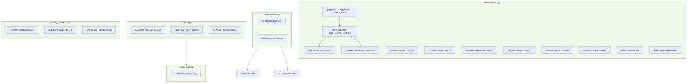

# Custom Analysis Guide

Everything behind `custom_analysis: true`. Scoring formulas, team ratings methodology, matchup scoring, and how all the numbers are calculated.

For command usage and flags, see the [Command Reference](command-reference.md). For system design, see [Architecture](architecture.md).

## Overview

Enable via `fpl init` or `custom_analysis: true` in settings.yaml. This unlocks:

- **New commands:** `captain`, `targets`, `differentials`, `waivers`, `allocate`, `transfer-eval`, `ratings`
- **Enriched existing commands:** `fpl stats` gains `--value` columns, `fpl xg` adds Value Picks, `fpl fdr` upgrades to Bayesian FDR with ATK/DEF split

All analysis is deterministic computation - no LLMs involved. Scores are reproducible given the same input data.

## Scoring Families

Two distinct scoring families optimise for different decision horizons:

| Family | Commands | Horizon | Weight Set |
|---|---|---|---|
| **Single-GW** | captain, bench, lineup, allocator (horizon=1) | This gameweek | `GW_SELECTION_WEIGHTS` |
| **Ownership** | targets, differentials, waivers | Multi-GW hold | `TARGET_QUALITY_WEIGHTS`, `DIFFERENTIAL_QUALITY_WEIGHTS`, `WAIVER_QUALITY_WEIGHTS` |

### QualityWeights System

All formulas define weights via `StatWeight`-based `QualityWeights` instances. Each `StatWeight` has a `multiplier` and a `cap`, ensuring cross-formula comparability. Weight sets are defined as frozen instances in `fpl_cli/services/scoring/constants.py`.

### Shared Components

**Minutes factor** adjusts scores for players who don't play full matches:

```
mins_factor = min(minutes / (appearances × 80), 1.0)
```

Disabled before GW5 (insufficient data). A player averaging 70 minutes per appearance gets ~88% of their score; 80+ gets the full score.

**Form trajectory** (0.8-1.2) is computed from a median-filtered slope of per-GW points over the last 7 GWs played (12-GW lookback cap). Rising form boosts the form contribution; falling form discounts it. Applied to the form component in all scoring contexts.

**Availability penalty** (-3pt) applied when a player's status != "a" and chance_of_playing < 75%. Reaches waiver scoring only -- see [Shared Flow](#shared-flow) for why target and differential are exempt.

## Matchup Scoring

### Position-Weighted Matchup

Matchup scores are position-weighted to reflect what matters for each role:

| Position | Atk | Def | Form± | Pos± |
|----------|-----|-----|-------|------|
| FWD | 45% | 5% | 35% | 15% |
| MID | 35% | 15% | 35% | 15% |
| DEF | 15% | 35% | 35% | 15% |
| GK | 5% | 45% | 35% | 15% |

A forward with high Atk and negative Def is fine - they're weighted 45% attack, only 5% defence.

**Atk (Attack Matchup)** - Scale: 0-10. How likely is this fixture to produce attacking returns?
```
Atk = (player's team goals/game at venue + opponent's goals conceded/game at venue) × 2.5
```
- 7-10 (green): Excellent attacking fixture
- 5-7 (yellow): Average
- 0-5 (red): Poor attacking fixture

**Def (Defence Matchup)** - Scale: 0-10. How likely is a clean sheet?
```
Def = (max(1 - team GC/game at venue ÷ 2.0, 0) + max(1 - opponent GS/game at venue ÷ 2.0, 0)) × 5
```
- 7-10 (green): Strong clean sheet chance (solid defence vs blunt attack)
- 4-6 (yellow): Average
- 0-3 (red): Likely to concede (leaky defence or prolific opponent)

**Form±** - Scale: -1.0 to +1.0. Recent momentum comparison (last 6 matches).
```
Form± = (player's team points - opponent's points) / 18
```

**Pos±** - Scale: -1.0 to +1.0. League table position advantage.
```
Pos± = (opponent's league position - player's team position) / 19
```

### Single-Fixture Score

Scale: 0-10. Inputs: team form, opponent form, venue, position. Produces per-fixture `FixtureMatchup` objects with opponent FDR (used for captain fixture classification and display; no longer an additive scoring component).

### 3-GW Recency-Weighted Matchup

`compute_3gw_matchup()` applies recency-weighted window `[0.5, 0.3, 0.2]` across the next three gameweeks. Returns a scalar average used by the ownership family via `_matchup_bonus` (weight 0.75).

## Single-GW Scoring

Used for decisions about **this gameweek**: who to captain, bench, and start.

### Captain Score

The captain score uses `GW_SELECTION_WEIGHTS`. Three ceiling components and two flat bonuses:

```
w = GW_SELECTION_WEIGHTS
form_score = min(form × w.form.multiplier, w.form.cap) × form_trajectory  # (1.5, 10) × [0.8-1.2]
xgi_score  = min((npxg + xa) × w.npxg.multiplier, w.npxg.cap)            # (5, 10) — or xgi_fallback path
xgi_score *= fixture_count

ceiling = (matchup_total × 2.0 + form_score + xgi_score) × pos_mult × mins_factor
score   = ceiling + home_bonus + pen_bonus
```

- **Matchup** (weight 2.0): Position-weighted matchup score, **summed** across fixtures (not averaged). DGW players get the full total of both fixtures.
- **Form** (1.5, cap 10): Recent FPL form score, multiplied by form trajectory (0.8-1.2). Not scaled by fixture count - a player in form is in form regardless of DGW.
- **xGI** (5, cap 10): npxG + xA per 90 when Understat data available; FPL-derived xGI per 90 as fallback. **Scaled by fixture count** for DGW.
- **Home bonus**: Flat bonus for home fixtures. Not multiplied by position.
- **Pen bonus**: penalty_xG per 90 × `w.penalty_xg.multiplier` (capped at `w.penalty_xg.cap`). Derived from `GW_SELECTION_WEIGHTS` via the `StatWeight` system. Not multiplied by position.

FDR is not an additive component in either scoring family.

#### Position Multiplier

Applies to the quality baseline in **both** scoring families:

1. **Single-GW family** (captain, bench, lineup): multiplies ceiling components (matchup + form + xGI) inside `calculate_single_gw_core`. Home and penalty bonuses are not attenuated.
2. **Multi-GW ownership family** (target, differential, waiver, value, allocate): multiplies the quality baseline inside `calculate_player_quality_score`. Matchup bonus, ownership bonus and position-need bonus are added un-attenuated on top.

| Position | Multiplier | Rationale |
|----------|-----------|-----------|
| FWD | 1.0 | Highest explosive upside per game (49% drop-off from top-1 to top-10 season scores) |
| MID | 1.0 | Similar ceiling to FWD via goals + clean sheet points |
| DEF | 0.85 | Consistent accumulators (28% drop-off) but lower per-GW ceiling |
| GK | 0.7 | Lowest per-GW ceiling; value comes from steady accumulation |

The multi-GW path was added on 2026-04-10 to stop cheap GKs (Raya, Kelleher, Darlow) dominating `raw_quality` and forcing the allocator into 5-3-2 / GK-captain solutions. See `docs/plans/2026-04-10-001-fix-multi-gw-scoring-position-rebalance-plan.md` for the empirical rationale and the supersession of the dc-per-90-calibration decision.

#### Normalisation

Raw scores are normalised to a 0-100 scale. The baseline: a single-GW FWD with a maximum score produces 32.0 raw points, which maps to 100.

### Bench Score

Shares `calculate_single_gw_core()` with captain scoring. Per-fixture matchup scores summed (not averaged), weighted by `matchup_weight` (bench/lineup: 1.5 vs captain: 2.0). Adds coverage and set-piece bonuses. Normalised via `BENCH_CEILING` (raw `priority_score_raw` exposed in output).

### Lineup Score

`calculate_lineup_score()` + `select_starting_xi()` picks the optimal starting XI from a 15-man squad. Uses the same single-GW core as bench scoring.

## Ownership Scoring

Used for **multi-GW decisions**: who to buy, hold, or pick up on waivers.

### Shared Flow

All three ownership scores route through `_calculate_quality_based_score()` / `_calculate_quality_based_raw()`:

1. **Quality baseline** via `calculate_player_quality_score()` with the relevant weight set
2. **Underperformance regression bonus** for players outperforming xG
3. **3-GW matchup** (scalar average, weight 0.75 via `_matchup_bonus`)
4. **Availability penalty** (-3pt when status flagged < 75%) -- **waiver only in practice**, see below
5. All three include `penalty_xG` via `StatWeight`

The availability penalty is in the shared flow but only reaches waiver scoring. It is gated on `status != "a"`, and the `PlayerStats` record behind `fpl stats --targets` / `--differentials` carries no `status` field, so the gate never opens there. That is deliberate rather than an oversight: those two lists are discovery surfaces answering a 3-6 GW question, while `chance_of_playing` is a next-round flag, and `fpl stats --available-only` already gives users an explicit lever for "only players I can field this week". Plumbing `status` into `PlayerStats` would silently switch the penalty on for both commands; `tests/test_stats.py::TestStatsAgentAvailabilityIsNotScored` fails if that happens.

A minutes factor adjusts per-90 quality components and the fixture component.

Scores normalised to 0-100, then subject to [early-season shrinkage](#early-season-confidence-gw1-10) before ranking.

### Target Score

Weight set: `TARGET_QUALITY_WEIGHTS`

Combines: npxG/90, xGChain/90 (or xGI/90 fallback), penalty xG/90, form (capped at 5, scaled by form trajectory 0.8-1.2), PPG (half weight), underperformance bonus, and 3-GW recency-weighted matchup (weight 0.75).

### Differential Score

Weight set: `DIFFERENTIAL_QUALITY_WEIGHTS`

Combines: npxG/90, xGChain/90 (or xGI/90 fallback), penalty xG/90, form (capped at 7, scaled by form trajectory 0.8-1.2), PPG (half weight), ownership bonus, underperformance bonus, and 3-GW recency-weighted matchup (weight 0.75).

### Waiver Score

Weight set: `WAIVER_QUALITY_WEIGHTS`

Combines: xGI/90, penalty xG/90, form (StatWeight(1.3, 7), scaled by form trajectory 0.8-1.2), PPG (half weight), underperformance bonus, and 3-GW recency-weighted matchup (weight 0.75).

**Key divergence from target/differential:** `mins_factor_override` applies a stricter combined factor (availability × per-appearance) because draft waivers are a season commitment; target/diff use standard `mins_factor`. Waiver also adds position-need and team-stacking adjustments post-quality.

## Squad Allocator

Selects the mathematically optimal 15-player squad using an ILP (Integer Linear Programming) solver.

### Scoring

The solver picks one squad that maximises expected points across the entire horizon - it does not optimise each gameweek independently. This means the per-player baseline score needs to estimate a player's *true underlying level*, which fixture coefficients then scale up or down per gameweek.

**Horizon >= 2** (default, wildcard, season-start): Uses multi-GW quality weights (`VALUE_QUALITY_WEIGHTS`) with form (1.3x), PPG (0.8x), npxG/xGI, xGChain, penalty xG, dc_per_90. Subject to early-season shrinkage. PPG and xGChain are included because they're predictive over multi-week windows; form is weighted lower than single-GW to avoid anchoring the entire horizon to a hot streak that mean-reverts.

**Horizon = 1** (Free Hit, single-GW decisions): Uses single-GW scoring (`GW_SELECTION_WEIGHTS`) - form (1.5x), npxG/xGI, penalty xG, per-fixture matchup scores. PPG and xGChain are dropped (not predictive for a single game). No shrinkage applied - single-GW decisions want the strongest current signal. Matchup scoring is baked into the player score, so fixture coefficients are the raw scores directly.

### Fixture Coefficients

For horizon >= 2, per-player, per-GW fixture coefficients use position-variant sensitivity:

| Position | Sensitivity |
|---|---|
| GK/DEF | 0.30 |
| MID | 0.15 |
| FWD | 0.10 |

**Modifier formula:** `max(0.25, 1.0 - sensitivity × (opponent_fdr - 4) / 3)`. Higher FDR = harder fixture = lower modifier.

**DGW handling:** Both fixture coefficients are summed (player plays twice). If only one fixture is confirmed and a DGW is predicted, the extra fixture is scaled by prediction confidence.

**BGW handling:** No confirmed fixtures + predicted blank: coefficient = `raw_quality × (1 - confidence)`. No prediction data: assumes a normal single fixture. Confidence values sourced from `fixture_predictions.yaml`.

### ILP Solver

Solves 7 independent ILPs (one per valid formation). The objective function maximises the weighted sum of expected contributions across all players and gameweeks:

```
max Σ(gw) Σ(p) discount[gw] × coeff[p][gw] × (starter[p] + bench_discount[p] × bench[p])
```

Where:
- **`coeff[p][gw]`** = raw_quality × fixture_modifier (horizon >= 2), or raw single-GW score (horizon = 1)
- **`discount[gw]`** = temporal discount weight (see below)
- **`bench_discount[p]`** = fractional value of a bench player relative to a starter: 0.15 (outfield), 0.05 (GK), or 1.0 (Bench Boost GW)

**Temporal discounting:** Geometric decay based on free transfers: `rate = 1.0 - 0.04 × FTs`, weights = `rate^gw_offset`. More FTs means more ability to course-correct later, so future gameweeks are discounted more aggressively. 0 FTs = flat weights (equal value across the horizon). 3 FTs: weights decay as [1.0, 0.88, 0.77, 0.68, ...].

Constraints:
- Budget cap
- Exactly 2 GK / 5 DEF / 5 MID / 3 FWD
- Max 3 players per team
- Valid starting XI

Picks the formation with the best objective value. Captain schedule derived post-hoc (highest-coefficient starter per GW).

### Free Hit: Two-Pass Solve

When all bench discount values are near zero (Free Hit regime, `--bench-discount`), the solver runs a two-pass **lexicographic solve** per formation:

1. **Solve 1** maximises total quality (starters + bench) - the standard objective.
2. **Solve 2** locks starter quality from Solve 1 as a floor constraint and adds a bench cost penalty (`-0.1 × price × bench_assignment`), pushing the solver toward cheaper bench players.

If Solve 2 maintains starter quality, it wins; otherwise the solver falls back to Solve 1. The rationale: on Free Hit you're transferring out anyway, so the bench should be as cheap as possible without degrading starters.

### Chip-Aware Modes

- **`--bench-discount`**: Override bench discount values per position. Near-zero values trigger the two-pass Free Hit solve above.
- **`--bench-boost-gw`**: Bench discount overridden to 1.0 for the specified GW (bench players valued equally to starters).
- **`--sell-prices`**: Uses actual sell prices for owned players in budget constraint. Budget auto-computed as `sum(sell_prices) + bank` unless `--budget` is explicitly set. Accepts JSON from `fpl squad sell-prices --format json`.

## Early-Season Confidence (GW1-10)

All scoring formulas apply confidence-weighted shrinkage in GW1-10. Normalised scores are shrunk toward the position mean, with shrinkage strength determined by each player's prior-season pts/90.

```
confidence = min(1.0, (gw / (gw + 6)) × (1 + prior_strength))
adjusted_score = position_mean + confidence × (score - position_mean)
```

Players with strong track records converge to current-season data faster; new signings with no PL history use a price-based confidence floor (capped at 0.5). Beyond GW10, confidence = 1.0 and scores are unmodified.

This is the player-level analogue of the team-level early-season blending in [Team Ratings](#early-season-blending-gw1-11).

### Who is left out

Shrinkage treats a low score as a small sample, so it only makes sense for players whose score could plausibly be higher. Two groups are held out entirely -- excluded from the position mean as well as from the adjustment, so their scores pass through untouched:

- **Ruled out of the next gameweek** (`chance_of_playing` is 0). This is FPL's own hard flag, not one of the 25/50/75 doubts, which stay in.
- **No minutes at all from GW6 onward**, once the minutes factor is live. Before GW6 the factor is disabled and nobody has played much, so zero minutes says nothing.

Without this, an injured or non-playing player is handed most of the position mean back and can rank above a player who is actually available with a weak but real score -- the low score is an observed fact about them, and confidence carries no availability signal to tell the two cases apart.

### Player Prior

`generate_player_prior()` computes per-player:
- **prior_strength**: Percentile rank of pts/90 within position (from vaastav historical data)
- **confidence**: Shrinkage control derived from prior_strength

Price-based fallback for players without PL history.

YAML cache (`config/player_prior.yaml`) with season/GW invalidation. Constants: `REGRESSION_CONSTANT=6`, `CUTOFF_GW=10`.

## Team Ratings

The data source behind FDR, captain picks, squad grid, and other fixture-aware commands. Not FPL's static FDR - these are calculated from real match data on a rolling window.

### Scale & Axes

4-axis team strength ratings on a 1-7 scale (1=best, 7=worst):

- **atk_home / atk_away**: Attacking strength (goals scored). Lower = more goals = better.
- **def_home / def_away**: Defensive strength (goals conceded). Lower = fewer conceded = better.

### Calculation

Fetch completed fixtures from the rolling 12-GW window, aggregate per-game averages for each team across four axes, then convert to 1-7 via percentile ranking against all 20 teams. Top 14% = 1, bottom 14% = 7.

A club needs a result at only one venue to be rated. Where it has none at the other, that axis is estimated from the venue it has played, rescaled by the ratio between home and away scoring across the whole window - home and away are different scoring environments, so copying a home rate straight onto the away axis would rank the club against other clubs' genuine away records at inflated value. `home_games` / `away_games` keep the counts actually observed, so an estimated axis reads as `1H/0A` rather than as a played record, and `fpl ratings update` names the clubs it estimated for. Requiring both venues instead emptied the league in the state where the command matters most: with GW1 finished and GW2 not started, every club has played exactly one match, so every club failed the check and ten finished results reported as nothing to calculate from.

### Position-Specific FDR

- FWD/MID fixtures scored by opponent's **defensive** rating (attacking opportunity).
- DEF/GK fixtures scored by opponent's **attacking** rating (clean sheet likelihood).

### Early-Season Blending (GW1-11)

Current-season data is blended with a prior from the previous season's Understat xG using Bayesian shrinkage (C=6). Current data takes majority weight by GW7; prior drops out entirely at GW12.

Both write paths apply it - the automatic refresh in `ensure_fresh()` and the user-facing `fpl ratings update`. They must not disagree: `fpl ratings update` saves with `based_on_gws` stamped, so an unblended file written by the command would look current to the auto-refresh and never be corrected.

A blend that is still mostly prior is labelled as such. Rating a single finished gameweek (see Calculation above) means the file stops being tagged `preseason_prior` as soon as GW1 completes, so the pre-season estimate warning no longer applies - but at a one-gameweek sample the ratings are 86% previous season, which is not ordinary current-season form either. `get_staleness_warning()` covers that middle ground while the sample is shorter than `REGRESSION_CONSTANT` gameweeks, quoting the weight the current sample actually carries. It is a note on a healthy file, not a fault: `advisory_warning()` marks it as such so `fpl doctor` reports OK and carries the note, rather than a stale finding with no remedy that clears it. Precedence still holds - a file that has also drifted off the current team set reports the drift, which is a real fault. Both write paths tag a blended file `_blended` so this is detectable at all - the auto-refresh previously saved a blended file as plain `auto_calculated`.

Whether a prior is blended in at all follows the season, not the window: shrinkage applies while fewer than 12 gameweeks have completed and stops after that, so `--since-gw 30` at GW34 is the recent-form view it advertises rather than a mostly-last-season one. Within that window the weight follows the gameweeks of current-season evidence in the sample rather than the absolute gameweek number, so `--since-gw 8` at GW10 is weighted as a three-gameweek sample. Blended files carry a `_blended` suffix on `metadata.source`.

### Before Results Land (pre-season, and GW1 in progress)

The FPL API publishes no strength ratings before a season starts - `strength` comes back null and the four attack/defence axes are zeroed for all 20 teams - so there is nothing to rate teams on and last season's cached file still lists relegated sides while missing promoted ones.

The same hole reopens once GW1 kicks off but before any of its fixtures finish. The API then reports GW2 as next, closing the pre-season branch, while `calculate_from_fixtures()` still returns nothing because no result exists yet. It narrows to that window only: as soon as one gameweek completes, single-venue clubs are rated on it (see Calculation above) rather than falling through to here. `seed_from_prior()` covers both windows - pre-season by gameweek number, the gap by the calculation coming back empty with no usable file on disk. "Usable" means more than non-empty: a file whose rated clubs no longer match the live league (`check_team_set()`) is treated as unusable too, since keeping it would leave the promoted sides unrated for as long as the new season produces nothing ratable.

Ratings are therefore rebuilt from the previous-season prior alone (Understat xG, with Championship form for promoted teams) and tagged `preseason_prior`. Commands that show fixture difficulty print a warning that the ratings are estimates until real results land. `fpl ratings update` seeds from the same prior when there is nothing to calculate from, or when the file on disk rates a different set of clubs to the current league, so `fpl doctor`'s "run `fpl ratings update`" hint resolves the stale file rather than dead-ending on it.

Promoted teams are placed on the Premier League scale, not the Championship's. Their per-game rates are re-expressed in PL units first - scored down, conceded up, since a promoted side does both against better opposition - and only then ranked in a single pool alongside the continuing teams, so the 1-7 spread describes the actual 20-team league. Ranking them among the division they just left would give its champion a rating of 1, nominally the best team in the Premier League, because the bucketing is purely ordinal. Without `FOOTBALL_DATA_API_KEY` there is no Championship data, and promoted teams share one undifferentiated bottom-of-table estimate instead.

The conversion sets *level* and *spread* separately, because they are separate claims. Level is a flat factor (`CHAMPIONSHIP_GOALS_SCORED_FACTOR = 0.665`, and its reciprocal on the conceded axes) applied to the division mean: it says promoted sides are worse than the league they are joining. Spread comes from standardising each team within the Championship and re-expressing that z-score in Premier League standard deviations, damped by a per-axis factor: it says a fraction of a team's edge over its own division survives promotion. One multiplicative factor cannot express the second - scaling a distribution scales its dispersion by the same amount as its level - so pushing the conceded mean up 50% also spread the cohort 50% wider than the pool it was about to be ranked in, putting the division's best defence in the Premier League's top three and its worst below any actual PL team.

The damping is mostly measured rather than chosen, per axis and per season:

```
k_axis = CHAMPIONSHIP_TRANSFER_COEFFICIENT * sqrt(rho_axis * PL_POOL_RELIABILITY)
```

`rho_axis` is the share of the division's observed spread on that axis that is not sampling noise. A team's per-game rate is the mean of 23 near-Poisson match results, so each team's own figure carries sampling variance `mu / n`, and what the table shows across teams is that noise on top of real differences. Removing the floor leaves what is worth ranking on. It varies enormously: on 2025-26 Championship results (playoffs excluded, and both Sheffield clubs dropped for the tla collision) it ran 0.37 / 0.58 / 0.14 / 0.00 across scored-home / scored-away / conceded-home / conceded-away. That last figure is not rounding - the observed spread in away goals conceded is *smaller* than Poisson noise over 23 games alone produces, so the whole ordering is consistent with chance and the axis contributes nothing. The square root is because rho is a variance ratio while `k` scales a standard deviation.

`POOL_RELIABILITY_BY_SOURCE` is the same quantity for the pool being ranked in: a true talent gap is a smaller share of a noisy pool's observed spread than of its true one. That is a property of the pool rather than of the Championship, so it is per source - the two prior sources measure the Premier League differently and are not equally noisy. Understat xG, the primary path, measured 0.57 over 2025-26, taking each team's sampling variance directly from its match-to-match xG rather than assuming Poisson, which does not hold for xG. The football-data fallback, which reads the league in actual goals, measured 0.33 on the Poisson floor that goals do obey. Applying the xG figure on the fallback path would overstate every promoted rating there by about 30%.

`CHAMPIONSHIP_TRANSFER_COEFFICIENT` is the one term with no measurement behind it - how much of a team's *true* Championship standing is true Premier League standing. Pinning it needs promoted sides' Championship season regressed on their following Premier League season, and football-data.org's free tier serves only the current season, so no such pair is obtainable on a free key. It is held at 1.0 so that it applies no shrinkage that is not measured elsewhere; `scripts/calibrate_promoted_prior.py` fits it, and the level factors, given the history.

Championship playoff results are excluded. football-data serves them in the same batch as the 46-game league season, and they land on exactly the teams that matter here - the playoff winner is one of the three promoted sides, and its final is at Wembley yet carries a nominal home team, so counting it credits a neutral-venue match to a promoted side's home record.

Two degenerate cases are called out explicitly rather than ranked silently: no ratings at all (every fixture would score a neutral 4.0) and ratings that fail to separate any two teams. `generate_prior()` returns nothing when no source has previous-season data, rather than a uniform 4.0 table: a flat prior would be indistinguishable from a real one, saved as "estimated ratings", cached for the season, and blended into genuine current form.

### xG-Based Calculation

`fpl ratings update --use-xg` recalculates using Understat xG instead of actual goals. Less noise, uses full season data rather than rolling window.

It stamps `based_on_gws` as `(1, gameweeks completed)`, the same way the fixtures path stamps its window. Saving no window at all meant the auto-refresh - which reads `based_on_gws` to decide whether a file already covers the completed gameweeks - treated an xG file as covering nothing and recalculated over it from goals on the next command, discarding the source the user had asked for; and the prior-dominance warning above, which needs a window to size the blend, could never fire over an xG file however prior-heavy it was.

### Manual Overrides

`team_ratings_overrides.yaml` (user config dir, `FPL_CLI_CONFIG_DIR`) lets you override specific axes for specific teams. Overrides are applied in-memory only and survive auto-refresh cycles.

Ratings are stored in `team_ratings.yaml` in the user data dir (`FPL_CLI_DATA_DIR`).

## Fixture-Adjusted npxG

The scoring pipeline normally consumes npxG/90 as a flat season average from Understat. A player with a soft early schedule accumulates a high rate and also earns a strong matchup score — double-counting fixture difficulty.

Fixture-adjusted npxG normalises historical xG by the Elo strength of each opponent before computing the per-90 rate. This isolates fixture difficulty to the matchup component alone.

### How it works

For each completed match within a 7-match / 12-GW rolling window:

1. **npxG approximation**: `xg - (penalties_scored + penalties_missed) × 0.76` (removes penalty xG from the Core-Insights match total)
2. **Adjustment factor**: `median_elo / opponent_elo`, capped at [0.80, 1.25] — a match against a 1900-Elo side is scaled up; a match against an 800-Elo side is scaled down
3. **Adjusted per-90**: `(npxg × factor) / minutes × 90` per match, averaged over qualifying matches
4. Players with fewer than 4 qualifying matches fall back to raw Understat npxG/90

The median Elo is computed fresh from the season's match data each run. Elo ratings come from per-gameweek `matches.csv` files in the Core-Insights dataset (`By Tournament/Premier League/GW{n}/`).

### Display

When `custom_analysis: true` and match data is available, `fpl player` shows:

```
adj. npxG/90: 0.312 (raw: 0.385)
```

The existing `npxG` panel line continues to show the raw Understat season total. In JSON output, `info.adjusted_npxg_per_90` and `info.raw_npxg_per_90` are added when custom analysis is enabled. Captain and transfer evaluation agent outputs include both fields when an adjustment is active.

If Core-Insights data is unavailable, the pipeline falls back to raw npxG/90 with no error surfaced to users.

## Quality & Value Scores

Available via `fpl stats --value` and `fpl player` when Understat data exists.

**quality_score** (0-100): Normalised player output quality using `VALUE_QUALITY_WEIGHTS`. Weights form and PPG heavily to capture current FPL points production rate. Every (family, position) pair normalises against its own **empirically calibrated ceiling**: `scripts/calibrate_quality_ceilings.py` replays the production scoring functions over a completed season's data at several gameweek snapshots and anchors each ceiling so the observed elite player lands ~92/100. `quality_score` is therefore a clean **elite-within-position** index — an elite MID, FWD, GK and DEF all read 80+ on their own scale. Cross-position comparisons (e.g. "is Haaland more elite than Raya?") are not meaningful — the ceilings differ by design.
- **GK**: dedicated signals via `for_gk()` weights — saves per 90, defensive quality (inverted xGC/90, range 0-2), and clean sheet rate; raw quality attenuated by 0.7. The form cap uses trajectory-only headroom (`× 1.2`) because `xgi_sustainability` is always 1.0 for non-ATK positions.
- **DEF**: `dc_per_90` (defensive contribution rate) replaces attacking xG stats via `without_xgi()`; raw quality attenuated by 0.85. Same trajectory-only form headroom as GK.
- **MID / FWD**: base weights, multiplier 1.0 — but separate calibrated ceilings: elite FWD raw quality runs ~12% above elite MID (one generational striker stretches the FWD tail), so a shared anchor would permanently under-score elite MIDs.

The calibrated ceilings live in `QUALITY_CEILINGS` in `services/scoring/constants.py`, in a generated block the script rewrites with `--write`, alongside a fingerprint of every scoring input the calibration depends on (weights, position multipliers, signal clamp bounds and interpolation shape). A drift-guard test recomputes that fingerprint, so changing any weight without re-running the calibration fails CI rather than silently mis-scaling scores. The fingerprint guards code-side inputs only — the anchors themselves are season data, so re-run the script with `--write` at each season rollover once the previous season completes (and any time the drift guard asks) — the historical failure mode where theoretical cap sums assumed signal saturation only DEF actually exhibits, leaving elite MID/FWD/GK reading ~60 where elite DEFs read ~89 (issue #88).

The same four families (target, differential, waiver, value) each carry four calibrated anchors: `MID_TARGET_CEILING`, `FWD_VALUE_CEILING`, etc. Ownership-family ceilings (target / differential / waiver) add headroom on top of the quality anchor for the matchup / ownership / position-need bonuses and the consistency bonus (max 0.75 target/waiver, 0.375 differential), so a top-pool player with high `cv_xgi_percentile` is not silently clamped to 100 and losing the consistency signal's discrimination.

**Early-season caveat (before ~GW6):** the "elite reads 80+" property holds from roughly GW6 and fully by GW10 — the calibration snapshots start at GW10, and before that the quality surface is dominated by tiny samples. Going into GW2, form and PPG are the same single observation of one gameweek's FPL points (jointly 56-90% of the ceiling depending on position), per-90 rates extrapolate from ≤90 minutes, and the minutes factor is disabled — so a one-game wonder saturates every cap and clips to 100 while an elite player with a quiet opener reads mid-pack (issue #143: Haaland 59 behind three role players at 92+ going into GW2). The scores are honest measurements of *what has happened so far*, not predictions; `fpl stats --value` surfaces this as a stderr notice and a `metadata.warnings` entry (`early_season_small_sample`) before GW6, and `--sort ep_next` gives a prior-informed alternative ranking in the meantime.

**GK ceilings scale with the calendar before GW6:** all three GK signals (saves/90, xGC quality, CS rate) are multiplied by a deliberate small-sample ramp, `min(minutes / 450, 1)` — but the calibrated anchors were measured at full ramp, which capped the entire GK pool in the low 70s at GW2 no matter how anyone played. `gk_ceiling_attainability` therefore scales the anchor's GK-signal share (from the weight caps) by the sample the *calendar* could have supplied — `(next GW − 1) × 90` minutes — so pre-GW6 keepers are read against what a keeper could have shown by that date. Keying on the calendar rather than the player's own minutes matters twice over: the scaling is identical for every keeper at a given gameweek (display order can never invert raw order within the position), and it expires at GW6 — a low-minute keeper deep into the season reads low because not playing is information about the player, not the date. Paths whose evaluations don't carry the GK signal block (the draft waiver, until `EnrichedPlayer` gains saves/xGC fields) stay on the full anchors — scaling only the denominator there would inflate keepers instead.

**quality_per_m**: `quality_score / price` (per £m). Within-position budget efficiency - higher means more output per pound. Not meaningful for cross-position comparison. Null when price is 0.

**pts_per_m**: `total_points / price` (per £m). Raw season points efficiency.

**form_per_m**: `form / price` (per £m). Recent form efficiency.

**rolling_pts_per_m**: Points per £m over the last N qualifying fixtures (configurable via `--window` on `fpl stats`, default from config). Captures recent form-adjusted value using actual points rather than model scores.

## Services Overview


```mermaid
flowchart TB
    subgraph Scoring["services/scoring/"]
        direction TB
        prepare["prepare_scoring_data() → ScoringData"]
        scoring_ctx["ScoringContext + build_scoring_context()"]
        build_matchups["build_fixture_matchups()"]
        compute_agg["compute_aggregate_matchup()"]
        captain_score["calculate_captain_score()"]
        target_score["calculate_target_score()"]
        diff_score["calculate_differential_score()"]
        waiver_score["calculate_waiver_score()"]
        bench_score["calculate_bench_score()"]
        lineup_score["calculate_lineup_score()"]
        select_xi["select_starting_xi()"]
        build_eval["build_player_evaluation()"]
        prepare --> scoring_ctx
        scoring_ctx --> build_matchups & compute_agg
    end

    subgraph Ratings["team_ratings.py"]
        direction TB
        svc["TeamRatingsService"]
        calc["TeamRatingsCalculator"]
        svc --> calc
    end

    subgraph Matchup["matchup.py"]
        direction TB
        matchup_fn["calculate_matchup_score()"]
        gw_maps["build_gw_fixture_maps()"]
        compute_3gw["compute_3gw_matchup()"]
    end

    subgraph FP["fixture_predictions.py"]
        direction TB
        fp_svc["FixturePredictionsService"]
        find_blank["find_blank_gameweeks()"]
        find_double["find_double_gameweeks()"]
    end

    subgraph TF["team_form.py"]
        tf_fn["calculate_team_form()"]
    end

    %% Cross-service dependencies
    Matchup --> TF
    Ratings --> UnderstatClient & FootballDataClient

    style Scoring fill:#f1f8e9,stroke:#33691e
    style Ratings fill:#f1f8e9,stroke:#33691e
    style Matchup fill:#f1f8e9,stroke:#33691e
    style FP fill:#f1f8e9,stroke:#33691e
    style TF fill:#f1f8e9,stroke:#33691e
```

**scoring** - Central scoring engine, a package under `fpl_cli/services/scoring/` with its public API re-exported from the package root (`constants` holds weights and ceilings, `signals` the form/consistency/npxG signals, `evaluation` the enrichment and evaluation types, `value_quality` / `ownership` / `single_gw` the scoring families, `display` the 0-100 normalisation, `shrinkage` the early-season adjustment, `data_prep` the shared fetching). `prepare_scoring_data()` fetches teams, fixtures, next GW, creates TeamRatingsService, builds a `ScoringContext`, and returns everything in a `ScoringData` frozen dataclass. Optional flags control additional fetching: `include_players`, `include_understat`, `include_history`, `include_prior` (Bayesian player priors) and `include_match_data` (Core-Insights consistency signals and fixture-adjusted npxG). `include_understat` and `include_prior` raise `ValueError` without `include_players`.

- **Form trajectory.** `include_history` batch-fetches per-GW player history via `get_player_detail()` for all players with minutes > 0. `compute_form_trajectory()` calculates a median-filtered slope of recent GW points, returning a multiplier (0.8-1.2).
- **Scoring context.** `ScoringContext` (frozen dataclass) holds pre-fetched data: team map, fixture map, ratings service, optional team form/understat. Built internally by `build_scoring_context()`.
- **Fixture matchups.** `build_fixture_matchups()` produces per-fixture `FixtureMatchup` objects. `compute_aggregate_matchup()` returns a scalar 3GW average.

`BenchOrderAgent` is enriched with Understat data (npxG, xGChain, penalty_xG) where available.

**Early-season shrinkage.** Both families' normalised scores are subject to confidence shrinkage via `shrink_scores()` (GW1-10). Per-player confidence is derived from prior-season pts/90 (vaastav data) via `player_prior.py`. `prepare_scoring_data(include_prior=True)` fetches priors into `ScoringData.player_priors`; each agent calls `apply_shrinkage()` between scoring and ranking, passing the hold-out set that `unavailable_player_ids()` builds from live player data. See [Who is left out](#who-is-left-out).

**player_prior** - Bayesian early-season confidence. See [Early-Season Confidence](#early-season-confidence-gw1-10).

**TeamRatingsService** - Persists team strength ratings to `team_ratings.yaml` in the user data dir. See [Team Ratings](#team-ratings).

**matchup** - Computes matchup scores (0-10). See [Matchup Scoring](#matchup-scoring).

**FixturePredictionsService** - Reads `fixture_predictions.yaml` for predicted BGW/DGW data with confidence levels — a current-season copy in the user config dir (`FPL_CLI_CONFIG_DIR`) takes precedence over the default shipped in the package. Pure functions `find_blank_gameweeks()` / `find_double_gameweeks()` detect from live fixture data.

**team_form** - Calculates rolling form stats (last 6 matches, venue splits, league position).
